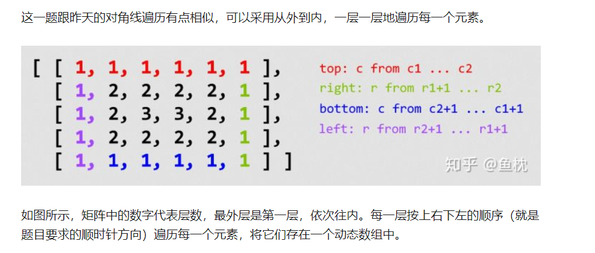

# 1. 题目
给定一个包含 m x n 个元素的矩阵（m 行, n 列），请按照顺时针螺旋顺序，返回矩阵中的所有元素。

示例 1:

输入:
[
 [ 1, 2, 3 ],
 [ 4, 5, 6 ],
 [ 7, 8, 9 ]
]
输出: [1,2,3,6,9,8,7,4,5]
示例 2:

输入:
[
  [1, 2, 3, 4],
  [5, 6, 7, 8],
  [9,10,11,12]
]
输出: [1,2,3,4,8,12,11,10,9,5,6,7]
# 2. Solution

# 3. Code
```
class Solution {
    public List<Integer> spiralOrder(int[][] matrix) {
        List<Integer> result  = new ArrayList<Integer>();
        
        if (matrix.length == 0)
        return result;
        int up = 0;
        int  right= matrix[0].length-1;
        int left = 0;
        int down = matrix.length -1;
        while (left<=right &&up<=down){
            
            //右
            for(int i = left;i<=right ;i++ ){
               result.add(matrix[up][i]);
            }
            
            
            //下
            for(int i= up +1;i<=down  ;i++){
                   result.add(matrix[i][right]);
            }
            
            
            if(up<down&&left<right){
                
                //左
            for(int i = right-1 ;i>left ;i--){
               result.add(matrix[down][i]);
            }
            
            //上
            for(int i=down ;i>up;i-- ){
                result.add( matrix[i][left]);
            }
            }
            
            left++;
            up ++;
            down --;
            right--;
        }
        return result ;
        
    }
}
```