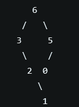

# 1. 题目
给定一个不含重复元素的整数数组。一个以此数组构建的最大二叉树定义如下：

二叉树的根是数组中的最大元素。
左子树是通过数组中最大值左边部分构造出的最大二叉树。
右子树是通过数组中最大值右边部分构造出的最大二叉树。
通过给定的数组构建最大二叉树，并且输出这个树的根节点。

Example 1:

输入: [3,2,1,6,0,5]
输入: 返回下面这棵树的根节点：

注意:

给定的数组的大小在 [1, 1000] 之间。
# 2. Solution
- 创建一个根节点，其值为数组的最大值
- 创建根节点的左节点，左节点的值为数组左半部分的最大值
- 创建根节点的右节点，右节点的值为数组右半部分的最大值
- 递归以上操作

# 3. Code
```/**
 * Definition for a binary tree node.
 * public class TreeNode {
 *     int val;
 *     TreeNode left;
 *     TreeNode right;
 *     TreeNode(int x) { val = x; }
 * }
 */
class Solution {
    public TreeNode constructMaximumBinaryTree(int[] nums) {
       return construct(nums,0,nums.length-1);
    }
    
    //递归方法
    public static TreeNode construct(int[] nums,int left,int right){
        if(left>right){
            return null;
        }
        //找出最大的下标
        int max = maxIndex(nums,left,right);
        TreeNode root = new TreeNode(nums[max]);
        
        root.left= construct(nums,left,max-1);
        root.right = construct(nums,max+1,right);
        //递归下去
        
        return root;
    }
    
    //找出最大的下标
    public static int maxIndex(int[] nums ,int left ,int right){
        
        //临时数组
       int temp = nums[left] ;
        //最大的下标
        int index = left ;
        
        for(int i=left+1;i<=right;i++){
            if(temp<nums[i]){
                temp= nums[i];
                index= i;
            }else {
            
                continue;
           }
                
            
        }
        return index;
    
    }
}
```