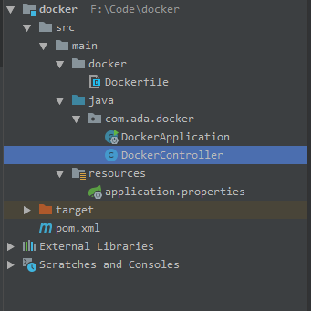

# 1. Docker安装工作
## 1.1. 安装 Docker 环境
- 在线安装docker环境
```
yum install docker
```
- 安装完成后，使用下面的命令来启动 docker 服务，并将其设置为开机启动

```
ervice docker start
chkconfig docker on
#LCTT 译注：此处采用了旧式的 sysv 语法，如采用CentOS 7中支持的新式 systemd 语法，如下：
systemctl  start docker.service
systemctl  enable docker.service
```

- 使用Docker 中国加速器
```
vi  /etc/docker/daemon.json
添加如下内容
{
    "registry-mirrors": ["https://registry.docker-cn.com"],
    "live-restore": true
}
```
- 重新启动docker
```
systemctl restart docker
```
- 输入docker version 返回版本信息则安装正常

# 2. Idea部署springboot项目
## 2.1. Idea相关准备工作

- 安装好docker的插件 ，在此配置

## 2.2. demo项目准备
- 新建一个项目

- 注意几个文件Dockerfile和pom文件的配置
- Dockerfile
```
FROM openjdk:8-jdk-alpine
ADD target/docker-0.0.1-SNAPSHOT.jar app.jar
ENTRYPOINT ["java","-Djava.security.egd=file:/dev/./urandom","-jar","/app.jar"]
```

- pom文件配置
```
pom中的build改成如下
<build>
        <plugins>
            <plugin>
                <groupId>org.apache.maven.plugins</groupId>
                <artifactId>maven-compiler-plugin</artifactId>
                <version>3.8.1</version>
                <configuration>
                    <source>1.8</source>
                    <target>1.8</target>
                    <encoding>UTF-8</encoding>
                </configuration>
            </plugin>
            <plugin>
                <groupId>org.springframework.boot</groupId>
                <artifactId>spring-boot-maven-plugin</artifactId>
                <configuration>
                    <mainClass>com.ada.docker.DockerApplication</mainClass>
                </configuration>
                <executions>
                    <execution>
                        <id>repackage</id>
                        <goals>
                            <goal>repackage</goal>
                        </goals>
                    </execution>
                </executions>
            </plugin>

            <!-- Docker maven plugin -->
            <plugin>
                <groupId>com.spotify</groupId>
                <artifactId>docker-maven-plugin</artifactId>
                <version>1.0.0</version>

                <configuration>
                    <dockerHost>http://云服务器地址:2375</dockerHost>
                    <imageName>${docker.image.prefix}/${project.artifactId}</imageName>
                    <dockerDirectory>src/main/docker</dockerDirectory>
                    <resources>
                        <resource>
                            <targetPath>/</targetPath>
                            <directory>${project.build.directory}</directory>
                            <include>${project.build.finalName}.jar</include>
                        </resource>
                    </resources>
                </configuration>

            </plugin>

            <!-- Docker maven plugin -->
        </plugins>


    </build>
```
- controller层代码
```
@RestController
public class DockerController {

    @RequestMapping("/")
    public String index() {
        return "Hello Docker!";
    }
}
```
## 2.3. 开始部署
- 首先先把项目打包，即是右键

完成后在项目的target文件下能看到个jar包
- docker的相关配置

- 成功之后访问即可