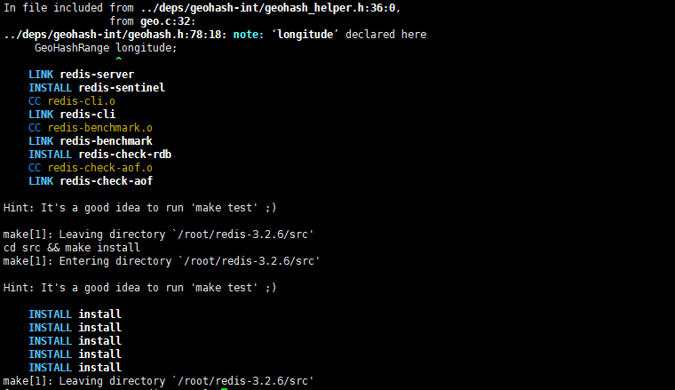
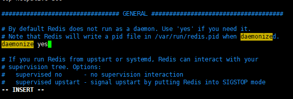

# 1. 首先下载Redis压缩包
```
wget : http://download.redis.io/releases/redis-3.2.6.tar.gz
```

# 2. 安装
```
tar -zxvf redis-3.2.6.tar.gz
cd redis-3.2.6
make && make install
```



# 3. 部署 
- 首先为了方便管理，将Redis文件中的conf配置文件和常用命令移动到统一文件中
```
 mkdir -p /etc/redis && cp redis.conf /etc/redis
 vim /etc/redis/redis.conf修改为： daemonize yes
```



# 4. redis 常用命令 

```
redis-server /usr…./redis.conf 启动redis服务，并指定配置文件

redis-cli 启动redis客户端

pkill redis-server 关闭redis服务

redis-cli shutdown 关闭redis客户端

netstat -tunpl |grep 6379 查看redis默认端口号6379占用情况

redis-cli flushall 清除缓存 

redis-server /etc/redis.conf 启动redis服务器

redis-server redis.conf 开启服务器
```