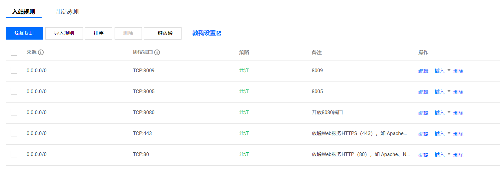
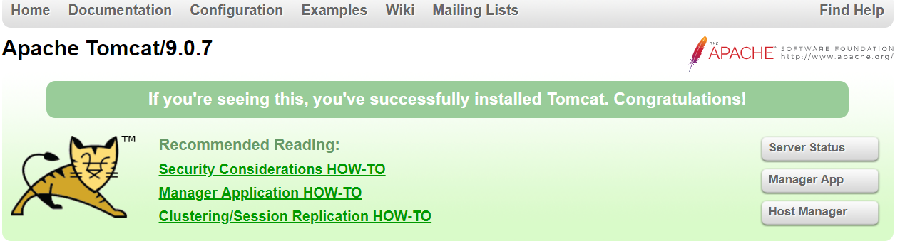
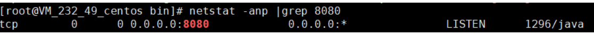
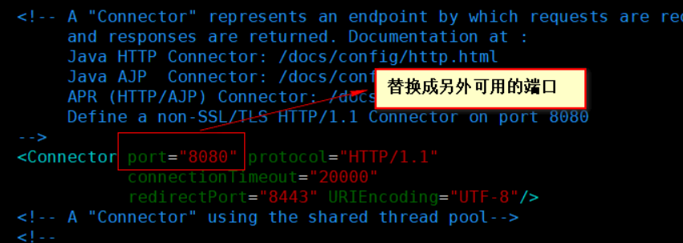

# 1. 创建目录
- 进入/usr/local目录中创建所需的文件夹
```
cd /usr/local
mkdir -p tools(用于保存下载或者上传上来的Tomcat文件)
mkdir -p tomcat(为了方便管理统一将Tomcat都安装到该目录)

```

-  进入/usr/local/tools，下载Tomcat9的安装文件

```
安装wget(若安装过忽略)：yum -y install wget
通过wget下载Tomcat：wget http://archive.apache.org/dist/tomcat/tomcat-9/v9.0.7/bin/apache-tomcat-9.0.7.tar.gz
 wget http://archive.apache.org/dist/tomcat/tomcat-8/v8.0.53/bin/apache-tomcat-8.0.53.tar.gz

```
对于这个下载链接大家需要注意的是Tomcat版本问题，比如若想安装的是Tomcat7，那你需要到Tomcat官网找到他对应的详细版本号替换成如下
```
http://archive.apache.org/dist/tomcat/tomcat-7/v7.0.86/bin/apache-tomcat-7.0.86.tar.gz
```
当然如果实在找不到下载的链接，可以直接到官网下载然后再通过FileZilla上传到服务器，说实话FileZilla能更直观地操作服务器上面的文件。

- 将下载到的文件(apache-tomcat-9.0.7.tar.gz)进行解压

/usr/local/tools/

`
解压：tar -zxvf apache-tomcat-9.0.7.tar.gz
`

- 复制解压文件到指定安装目录 
解压之后将得到一个apache-tomcat-9.0.7文件夹，需要将其复制到指定的安装目录/usr/local/tomcat/apache-tomcat-9.0.7/,因为我可能会安装多个版本的Tomcat，因此我在tomcat目录下又以Tomcat的版本号来区分存放。

mv apache-tomcat-9.0.7  ../tomcat/apache-tomcat-9.0.7/
这样，Tomcat9的下载安装已经完成，剩下的就是完成相关配置。

# 2. Tomcat的相关配置
- 配置Tomcat环境变量
`cd /etc`

`vim profile `
- 在profile文件后面添加如下配置，涉及到的路径修改成自己实际安装的路径即可

```
CATALINA_HOME=/usr/local/tomcat/apache-tomcat-9.0.7
CATALINA_BASE=/usr/local/tomcat/apache-tomcat-9.0.7
PATH=$PATH:$CATALINA_BASE/bin
export PATH CATALINA_BASE
```

- 配置Tomcat开机自启
```
cd /usr/lib/systemd/system
mkdir tomcat9.service
vim tomcat9.service
```

- 在Tomcat9.service文件中完成如下配置，路径需要修改成自己实际安装的路径

```
[Unit]
Description=Tomcat
After=syslog.target network.target remote-fs.target nss-lookup.target

[Service]
Type=oneshot
ExecStart=/usr/local/tomcat/apache-tomcat-9.0.7/bin/startup.sh
ExecStop=/usr/local/tomcat/apache-tomcat-9.0.7/bin/shutdown.sh
ExecReload=/bin/kill -s HUP $MAINPID
RemainAfterExit=yes

[Install]
WantedBy=multi-user.target
```

- 保存退出之后，
执行systemctl enable tomcat9.service,使Tomcat9开机自启。Tomcat的其他操作如下：

```
启动Tomcat：systemctl start tomcat9.service

关闭Tomcat：systemctl stop tomcat9.service

重启Tomcat：systemctl restart tomcat9.service

查看Tomcat状态：systemctl status tomcat9.service

进入tomcat安装目录下的bin目录，执行startup.sh or shutdown.sh也可以开启/关闭Tomcat
```

- 开放安全组

完成以上的配置就可以访问Tomcat了，在浏览器输入http://ip:8080,出现Tomcat主页则说明安装成功了。

Tomcat主页


# 3. 修改Tomcat的访问端口

- 首先，可以了解一下如何查看某个端口是否被占用：
`netstat -anp | grep 8080`
若没有任何信息显示则说明该端口可使用，若是出现类似下面信息则说明该端口不可用


- 接下来就可以按照下面步骤来修改可使用的端口号了：
```
cd /usr/local/tomcat/apache-tomcat-9.0.7/conf (需要替换成你的Tomcat按照目录)
vim server.xml
```
- 修改下面配置

