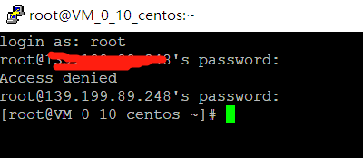

# 1. 本地 Windows 计算机密码登录
## 1.1. 登录工具
使用 远程登录软件 ，采用密码登录 Linux 实例（本例中选择使用 PuTTY，用户也可以选择其他类型的登录软件）。

## 1.2. 操作步骤
安装 Windows 远程登录软件，参考下载地址：https://www.chiark.greenend.org.uk/~sgtatham/putty/latest.html
使用 PuTTY 连接 Linux 云服务器。打开 PuTTY 客户端，在PuTTY Configuration 窗口中输入以下内容：
Host Name：云服务器的公网 IP（登录 云服务器控制台，可在列表页及详情页中获取主机公网IP）。
Port：云服务器的端口，必须填 22。（请确保云服务器 22 端口已开放，详见查看 安全组 及 网络ACL）
Connect type：选择“ SSH ”。
输入完后，单击【Open】，创建一个新对话。

在 PuTTY 会话窗口中，输入前提条件中获得的管理员帐号，按回车键。再输入前提条件中获取的登录密码，回车完成登录过程

