# 1. 服务器端的配置
修改TomcatHOME/bin/catalina.sh，添加如下配置

```
export CATALINA_OPTS="-Dcom.sun.management.jmxremote 
-Dcom.sun.management.jmxremote.port=1099 
-Dcom.sun.management.jmxremote.ssl=false 
-Dcom.sun.management.jmxremote.authenticate=false 
-Djava.rmi.server.hostname=192.168.25.129"
```
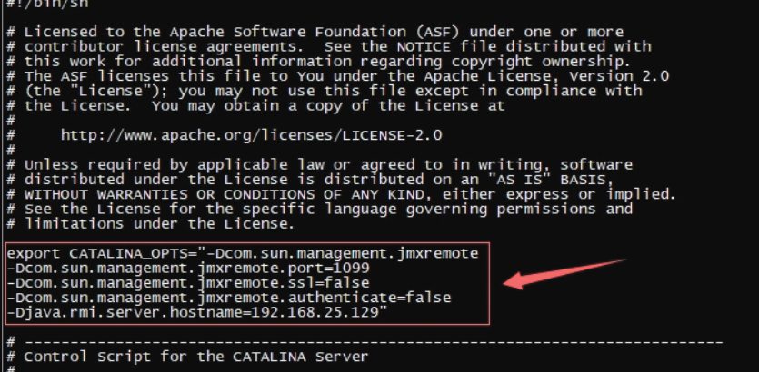
注意：hostname为你自己远程服务器的ip地址
# 2. 设置IDEA的Deployment
- IDEA上Deployment的设置入口：导航栏Tools-->Deployment-->Configuration。 
新建一个Deployment 
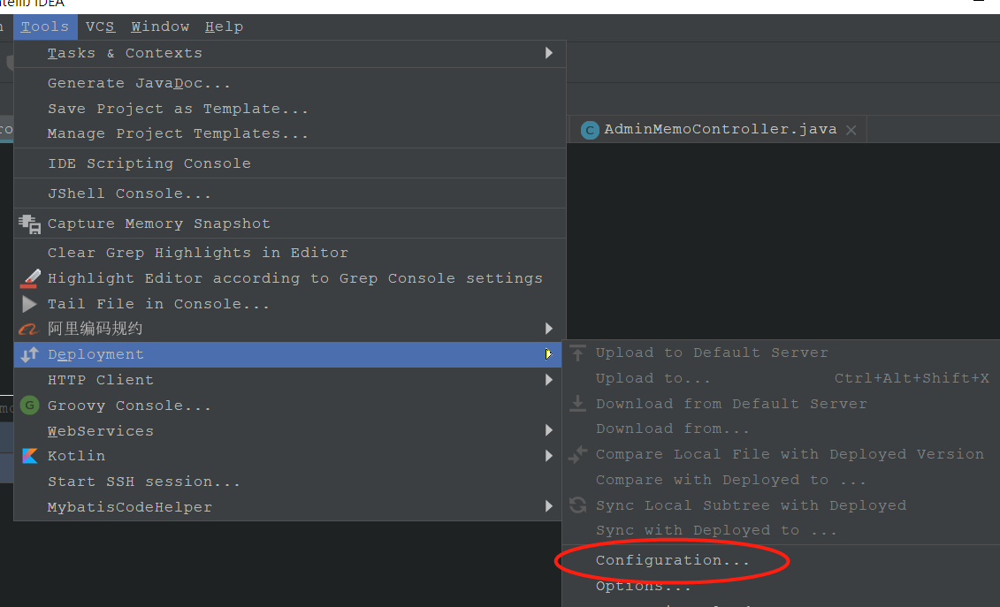

- 相关信息信息设置 
Port:服务器的连接端口为22，请确认你的服务器是否开放了该端口 
服务器连接验证方式：有三种，如果没有了解过秘钥的同学最好选择密码登录。 
Root Path的设置：在服务器连接测试成功之后，将Tomcat的webapps目录作为根目录，webapps目录是存放可访问项目（即网站）的目录，在之后我们会将编译后的项目上传到这里 

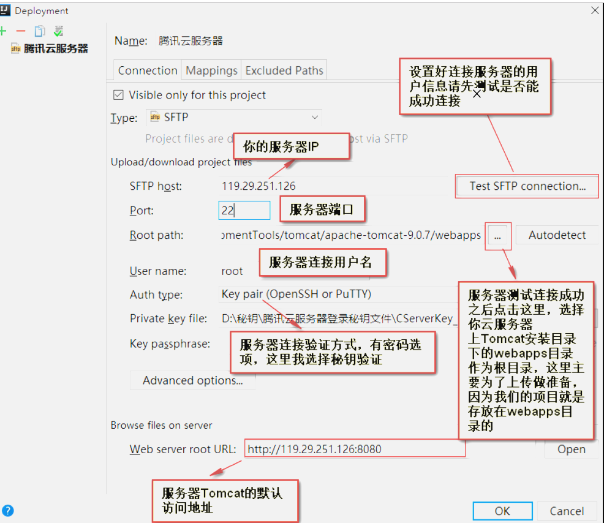


# 3. IDEA的run Configuration配置
- Run Configuration的设置入口 
选择远程Tomcat 
Run Configuration的相关配置 
Name:即Run Configuration配置的名称 
Application server:服务器上运行项目的Tomcat版本，注意由于这里只能选择本地的Tomcat版本，为此服务器的Tomcat版本必须与本地Tomcat版本一致，这样才能保证配置的Tomcat版本与服务器真实运行的Tomcat版本一致 
Host:选择我们上一步配置的Deployment 
Path from root:这个是项目编译后上传的目录设置，填写根目录符号“/”,它其实映射的目录是Tomcat的webapps目录，因为在配置Deployment中我们设置过了 
Mapped as:这个配置也是填写Tomcat的webapps目录，这个配置我也不是很明白，网上一些教程说的又很矛盾，英文好的同学看IDEA官方文档吧 
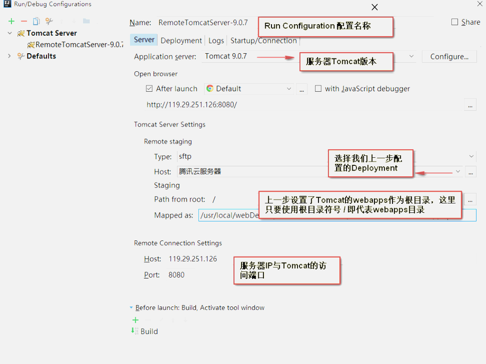

- 项目编译文件打包、浏览器访问、jmx端口的设置 
Artifacts:项目的打包部署设置，[详细参考这里理解 IntelliJ IDEA 的项目配置和Web部署](https://www.cnblogs.com/deng-cc/p/6416332.html) 

Application context：看到有些资料说是应用上下文，其实可以理解它用于绑定访问上一步设置Artifact。Artifact即项目编译后的Java类、web资源等整合，本地运行项目后它会被自动上传部署到我们的远程Tomcat上面，这样通过ip:8080/Application context/就能访问到我们指定项目，也就是我们的JavaWeb项目 
JMX port:需要跟我们之前服务器端设置的jmx端口保持一致 

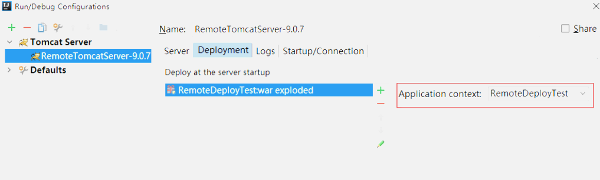

- 本地运行项目、IDEA自动部署

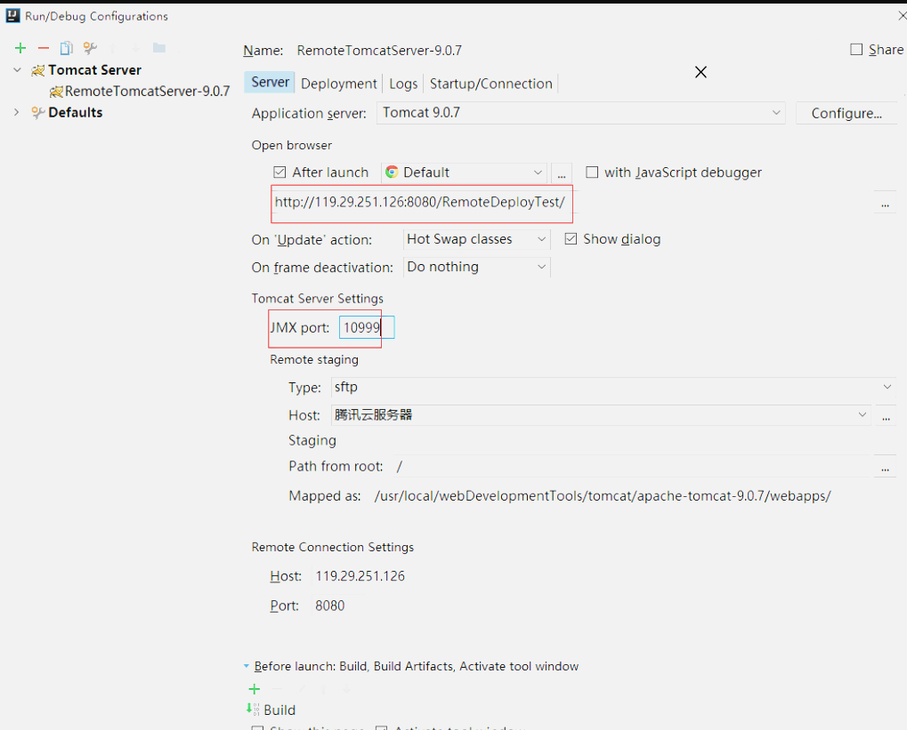
# 4. 将应用打成war包
- 步骤1：打开Project Structure --> 选择Artifacts --> 点击+ --> Web Application: Archive --> For 'webapp: war exploded'

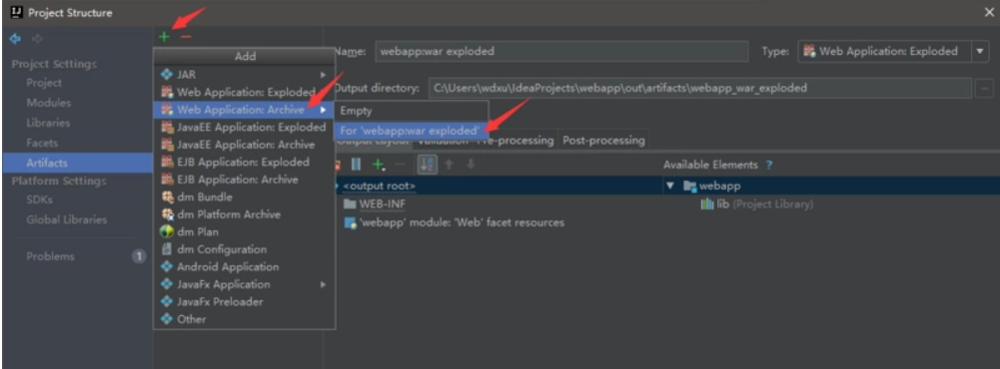

- 步骤2：生成manifest文件：点击Create Manifest且同意IDEA建议的位置 (web/META-INF/MANIFEST.MF)
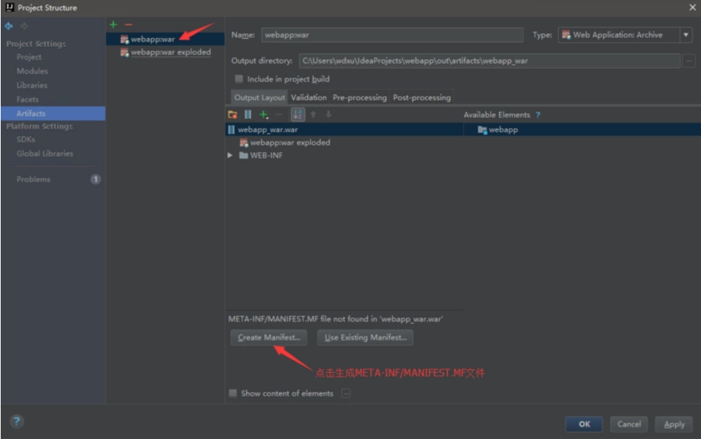
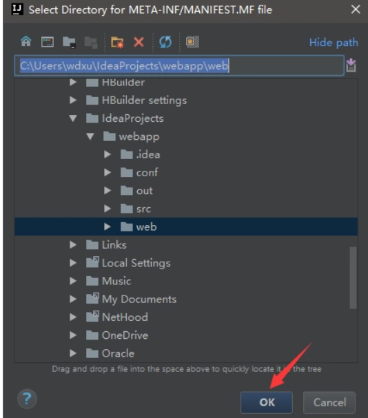

- 步骤3：点击Project Structure对话框的OK按钮
- 步骤4：Build --> Build Artifacts --> 在弹出的Build Artifact弹出框选择webapp:war下的Bulid，点击

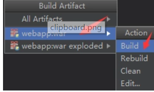

至此，项目打包成功，可以在工程的out/artifacts/webapp_war下看到war包，IDEA默认以工程名+_war.war来命名
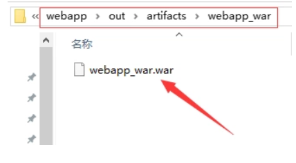

也可以在磁盘上看到这个war包