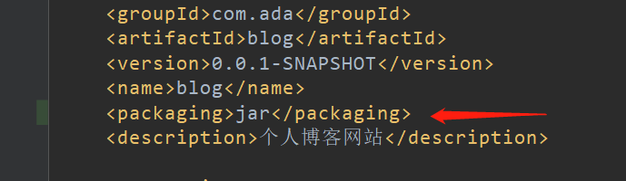
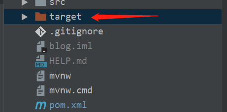
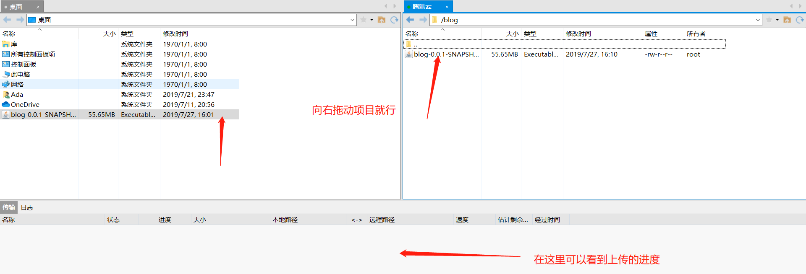
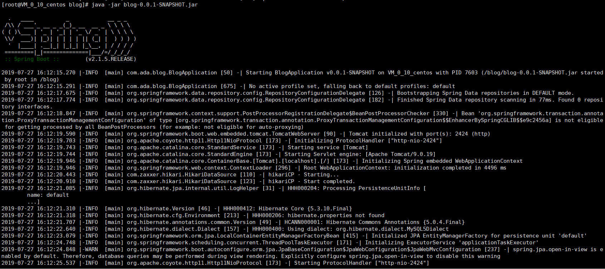
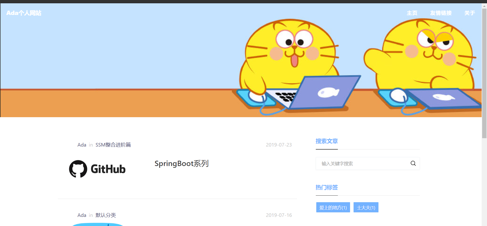

# 1. 服务到腾讯云上（Jar形式）
- 首先，我的项目是springboot项目，且是基于maven的，自带有Tomcat插件
```
            <plugin>
                <groupId>org.springframework.boot</groupId>
                <artifactId>spring-boot-maven-plugin</artifactId>
                <configuration>
                    <!-- fork:如果没有该配置，这个devtools不会起作用，即应用不会restart -->
                    <fork>true</fork>
                </configuration>
            </plugin>
```

- 在这里要加上jar包，如图


- 在maven插件这里，点击install，


- 然后在target目录下就有一个jar包，


- 将jar包通过xftp（xftp这个东西好烦，老是要更新，然后各种问题）


- 用xshell连接上云服务器上，cd到根目录下，运行
`java -jar xxx(jar的名称，后缀也要加上去)`


- 至此，打开链接就可以到网站了
