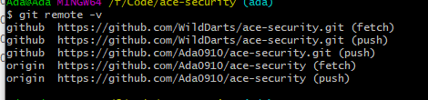

# 1. GitHub常用命令
 - 创建dev-main分支
```
git checkout -b dev-main 
```
- 查看本地和远程所有分支

```
    git branch -a
```

- 删除本地分支

```
    git branch -D branch_name
```

- 删除远程分支

```
    git push origin -d branch_name
```

# 2. Git分支的创建
- 新建分支
```
git checkout -b <branchName>
```

- 提交
```
git commit -m "提交的信息说明"
```

- 切换分支
```
git checkout <branchName>
```

- 合并到<branchName>上
```
git merge <branchName>
```

- 删除分支（非必须）
```
git branch -d <branchName>
```

- 查看所有分支
```
git branch -a
```
# 3. 一个项目提交到多个远程地址上
```
git remote add github https://github.com/WildDarts/ace-security.git
git push -u github master
```
- 向远程提交代码
```
git push all --all
```
- 查看远程仓库的地址
```
git remote -v
```
如果出现了以下这种情况

那么就说明需要push两次
## 3.1. 使用 git remote set-url 命令
 - 删除方法一的 xxx 远程仓库。

```
git remote rm xxx
```

- 使用如下命令添加远程仓库。

```
git remote set-url --add github   xxxx
```

- 查看远程仓库情况。可以看到 github 远程仓库有两个 push 地址。这种方法的好处是每次只需要 push 一次就行了。

```

git remote -v
github a.git (fetch)
github  a.git (push)
github  b.git (push)
```
## 3.2. 修改配置文件

打开 .git/config 找到 [remote "github"]，添加对应的 url 即可，效果如下。这种方法其实和方法二是一样的。

```
[remote "github"]
	url = https://github.com/WildDarts/ace-security.git
	fetch = +refs/heads/*:refs/remotes/github/*
	url = https://github.com/Ada0910/ace-security.git
```
# 4. Git的撤销操作
## 4.1. git add 添加 多余文件
- 这样的错误是由于， 有的时候可能
```
git add . （空格+ 点） 表示当前目录所有文件，不小心就会提交其他文件
git add 如果添加了错误的文件的话
```

- 撤销操作
```
git status 先看一下add 中的文件
git reset HEAD 如果后面什么都不跟的话 就是上一次add 里面的全部撤销了
git reset HEAD XXX/XXX/XXX.java 就是对某个文件进行撤销了
```
## 4.2. git commit 错误
- 如果不小心 弄错了 git add后 ， 又 git commit 了。
```
先使用
git log 查看节点
commit xxxxxxxxxxxxxxxxxxxxxxxxxx
Merge:
Author:
Date:
然后
git reset commit_id
```
over

PS：还没有 push 也就是 repo upload 的时候

```
git reset commit_id （回退到上一个 提交的节点 代码还是原来你修改的）
git reset –hard commit_id （回退到上一个commit节点， 代码也发生了改变，变成上一次的）
```
## 4.3. 如果要是 提交了以后，可以使用 git revert

- 还原已经提交的修改
此次操作之前和之后的commit和history都会保留，并且把这次撤销作为一次最新的提交
```
git revert HEAD 撤销前一次 commit
git revert HEAD^ 撤销前前一次 commit
git revert commit-id (撤销指定的版本，撤销也会作为一次提交进行保存）
git revert是提交一个新的版本，将需要revert的版本的内容再反向修改回去，版本会递增，不影响之前提交的内容
```