# 1. 面试题目
## 1.1. springMVC的工作原理
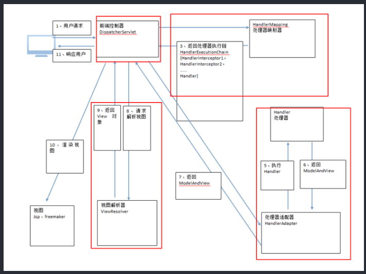
## 1.2. 线程有用过吗
## 1.3. hashtable和hashmap有什么区别
## 1.4. jdk1.8版本的比之前有什么区别
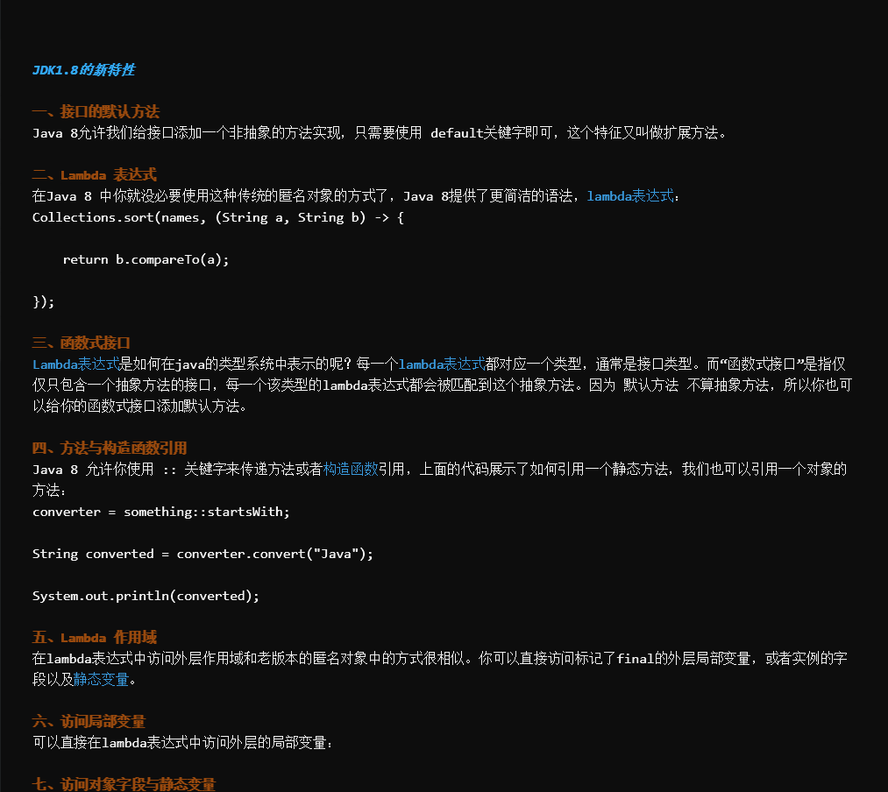
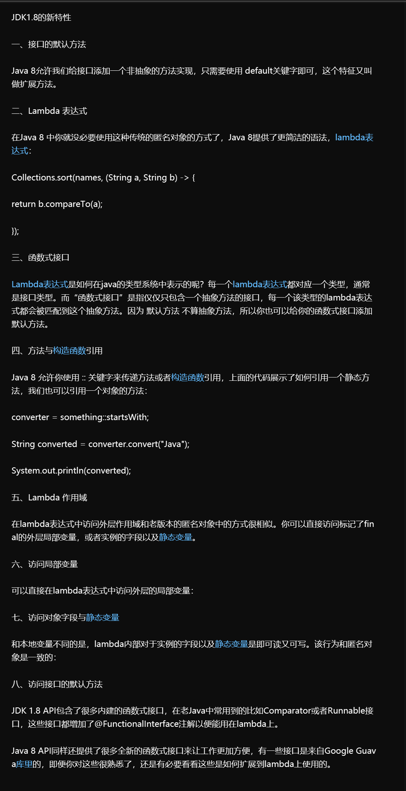
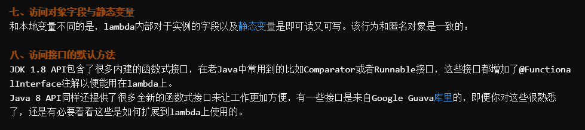

## 1.5. 持久层有了解过多少，用过吗？线程了解过吗？
## 1.6. 数据库用的什么？用过数据库建模吗？游标这些呢？
## 1.7. jsp标签用过哪些？
## 1.8. 算法用过哪些？
## 1.9. 做过哪些项目？
## 1.10. orm是什么？
## 1.11. 项目中有用到JavaScript吗？能不能区分Java和JavaScript的语法
## 1.12. 多态和继承有什么区别
## 1.13. MVC模式是什么
## 1.14. 前端框架认识多少？
## 1.15. Java的命名规范
 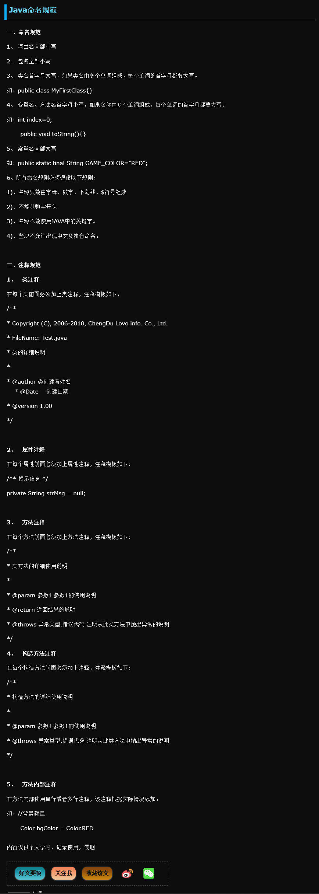
## 1.16. 字节流和字符流有什么区别？
 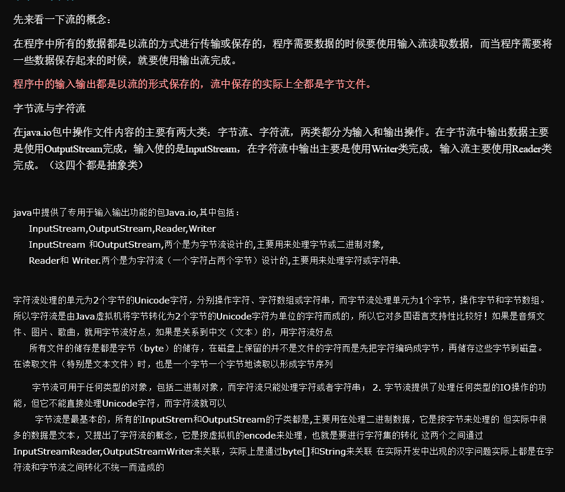
## 1.17. 接口和抽象类的联系和区别
 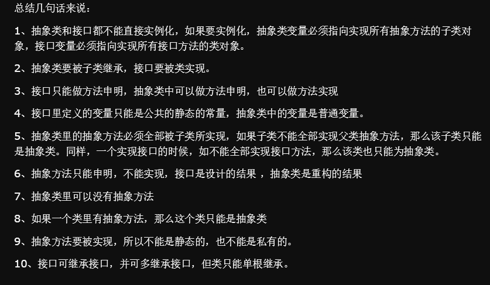
 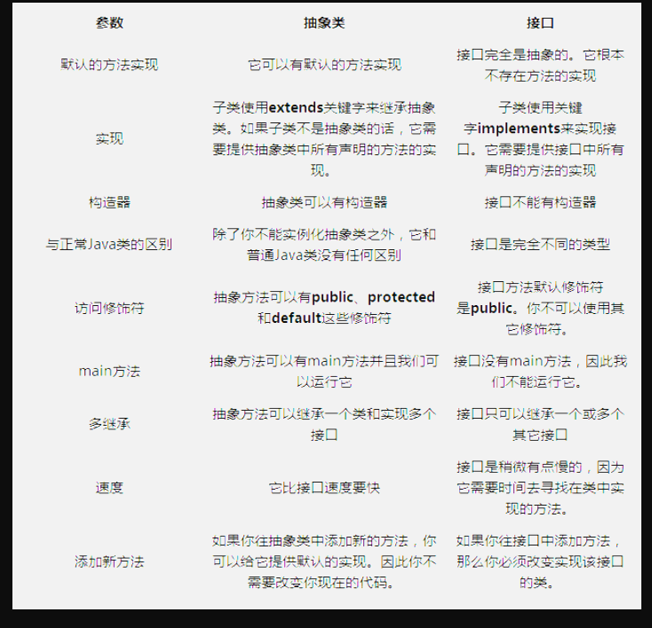
## 1.18. Java的基础数据类型
## 1.19. 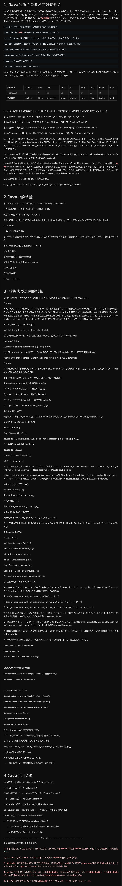
## 1.20. jsp中的如何自定义标签
## 1.21. MyBatis中的一级缓存和二级缓存是什么？有什么区别
## 1.22. Java的基础类型是否有默认值？
 
 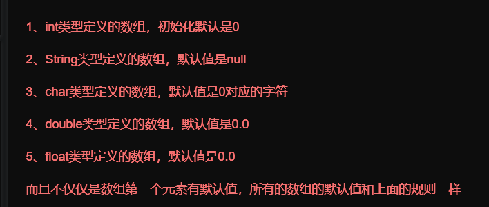
## 1.23. Java创建一个基本数据类型和引用基本类型有什么区别
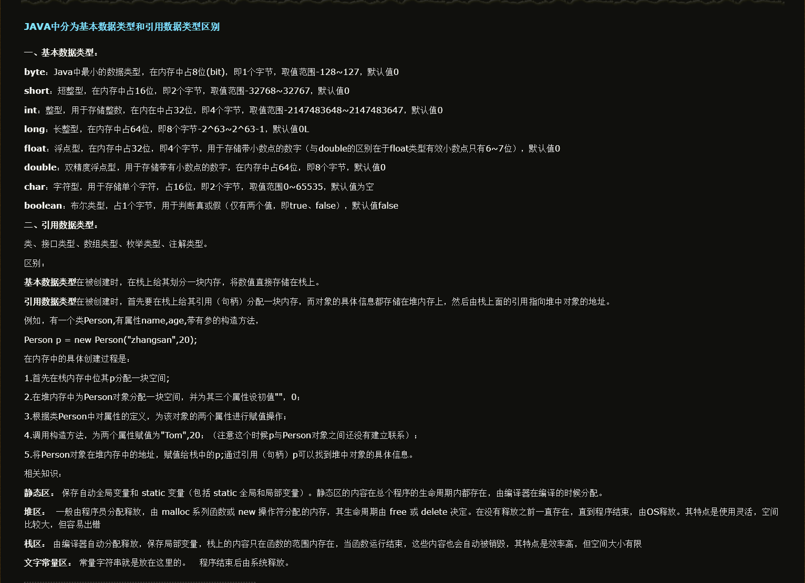
## 1.24. 重写和重载的区别
  重载（Overload）是让类以统一的方式处理不同类型数据的一种手段，实质表现就是多个具有不同的参数个数或者类型的同名函数（返回值类型可随意，不能以返回类型作为重载函数的区分标准）同时存在于同一个类中，是一个类中多态性的一种表现（调用方法时通过传递不同参数个数和参数类型来决定具体使用哪个方法的多态性）
    　重写（Override）是父类与子类之间的多态性，实质是对父类的函数进行重新定义，如果在子类中定义某方法与其父类有相同的名称和参数则该方法被重写，不过子类函数的访问修饰权限不能小于父类的；若子类中的方法与父类中的某一方法具有相同的方法名、返回类型和参数表，则新方法将覆盖原有的方法，如需父类中原有的方法则可使用 super 关键字
## 1.25. Java堆
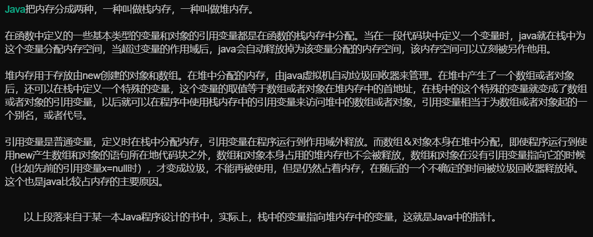
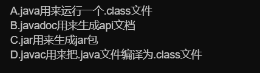
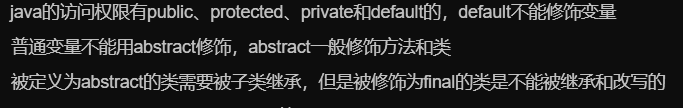
方法区:  1.又叫静态区，跟堆一样，被所有的线程共享。方法区包含所有的class和static变量。 2.方法区中包含的都是在整个程序中永远唯一的元素，如class，static变量