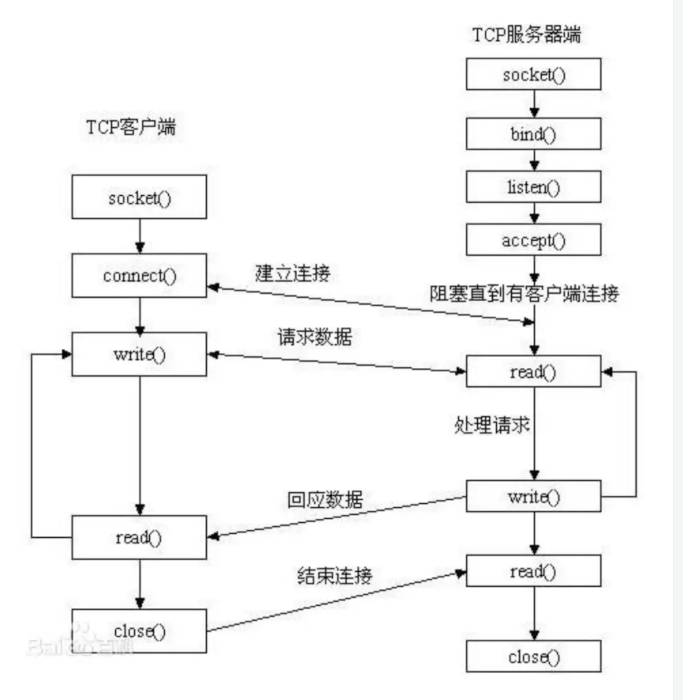
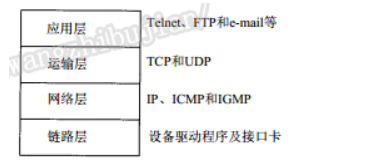
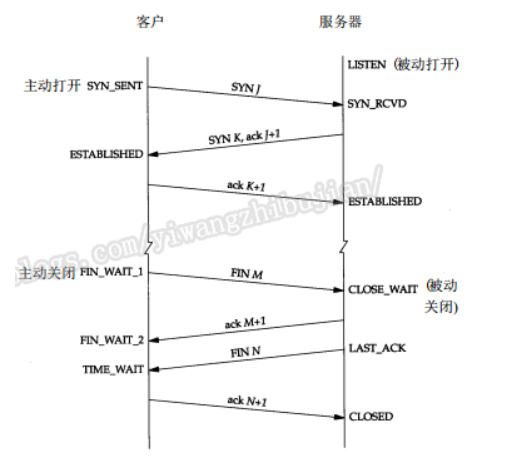
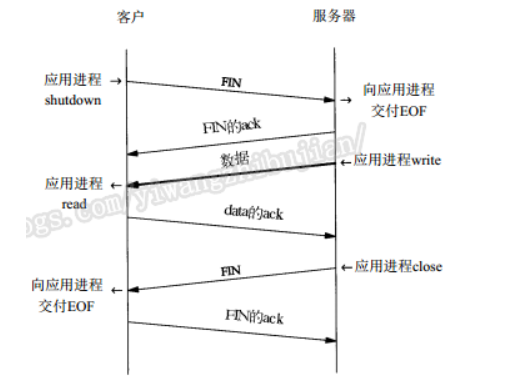

# 1. 建立socket的基本流程


# 2. Socket通信基本示例
　　这种模式是基础，必须掌握，后期对Socket的优化都是在这个基础上的，也是为以后学习NIO做铺垫。

复制代码
```
package yiwangzhibujian.onlysend;

import java.io.InputStream;
import java.net.ServerSocket;
import java.net.Socket;

public class SocketServer {
  public static void main(String[] args) throws Exception {
    // 监听指定的端口
    int port = 55533;
    ServerSocket server = new ServerSocket(port);
    
    // server将一直等待连接的到来
    System.out.println("server将一直等待连接的到来");
    Socket socket = server.accept();
    // 建立好连接后，从socket中获取输入流，并建立缓冲区进行读取
    InputStream inputStream = socket.getInputStream();
    byte[] bytes = new byte[1024];
    int len;
    StringBuilder sb = new StringBuilder();
    while ((len = inputStream.read(bytes)) != -1) {
      //注意指定编码格式，发送方和接收方一定要统一，建议使用UTF-8
      sb.append(new String(bytes, 0, len,"UTF-8"));
    }
    System.out.println("get message from client: " + sb);
    inputStream.close();
    socket.close();
    server.close();
  }
}
```

　　服务端监听一个端口，等待连接的到来。


```
package yiwangzhibujian.onlysend;

import java.io.OutputStream;
import java.net.Socket;

public class SocketClient {
  public static void main(String args[]) throws Exception {
    // 要连接的服务端IP地址和端口
    String host = "127.0.0.1"; 
    int port = 55533;
    // 与服务端建立连接
    Socket socket = new Socket(host, port);
    // 建立连接后获得输出流
    OutputStream outputStream = socket.getOutputStream();
    String message="你好  yiwangzhibujian";
    socket.getOutputStream().write(message.getBytes("UTF-8"));
    outputStream.close();
    socket.close();
  }
}
```

　　客户端通过ip和端口，连接到指定的server，然后通过Socket获得输出流，并向其输出内容，服务器会获得消息。最终服务端控制台打印如下：

server将一直等待连接的到来
get message from client: 你好  yiwangzhibujian
　　通过这个例子应该掌握并了解：

Socket服务端和客户端的基本编程
传输编码统一指定，防止乱码
　　这个例子做为学习的基本例子，实际开发中会有各种变形，比如客户端在发送完消息后，需要服务端进行处理并返回，如下。

# 3. 消息通信优化
## 3.1. 双向通信，发送消息并接受消息
　　这个也是做为Socket编程的基本，应该掌握，例子如下：

复制代码
```
package yiwangzhibujian.waitreceive;

import java.io.InputStream;
import java.io.OutputStream;
import java.net.ServerSocket;
import java.net.Socket;

public class SocketServer {
  public static void main(String[] args) throws Exception {
    // 监听指定的端口
    int port = 55533;
    ServerSocket server = new ServerSocket(port);
    
    // server将一直等待连接的到来
    System.out.println("server将一直等待连接的到来");
    Socket socket = server.accept();
    // 建立好连接后，从socket中获取输入流，并建立缓冲区进行读取
    InputStream inputStream = socket.getInputStream();
    byte[] bytes = new byte[1024];
    int len;
    StringBuilder sb = new StringBuilder();
    //只有当客户端关闭它的输出流的时候，服务端才能取得结尾的-1
    while ((len = inputStream.read(bytes)) != -1) {
      // 注意指定编码格式，发送方和接收方一定要统一，建议使用UTF-8
      sb.append(new String(bytes, 0, len, "UTF-8"));
    }
    System.out.println("get message from client: " + sb);

    OutputStream outputStream = socket.getOutputStream();
    outputStream.write("Hello Client,I get the message.".getBytes("UTF-8"));

    inputStream.close();
    outputStream.close();
    socket.close();
    server.close();
  }
}
```
复制代码
　　与之前server的不同在于，当读取完客户端的消息后，打开输出流，将指定消息发送回客户端，客户端程序为：

复制代码
```
package yiwangzhibujian.waitreceive;

import java.io.InputStream;
import java.io.OutputStream;
import java.net.Socket;

public class SocketClient {
  public static void main(String args[]) throws Exception {
    // 要连接的服务端IP地址和端口
    String host = "127.0.0.1";
    int port = 55533;
    // 与服务端建立连接
    Socket socket = new Socket(host, port);
    // 建立连接后获得输出流
    OutputStream outputStream = socket.getOutputStream();
    String message = "你好  yiwangzhibujian";
    socket.getOutputStream().write(message.getBytes("UTF-8"));
```
    //通过shutdownOutput高速服务器已经发送完数据，后续只能接受数据
```
    socket.shutdownOutput();
    
    InputStream inputStream = socket.getInputStream();
    byte[] bytes = new byte[1024];
    int len;
    StringBuilder sb = new StringBuilder();
    while ((len = inputStream.read(bytes)) != -1) {
      //注意指定编码格式，发送方和接收方一定要统一，建议使用UTF-8
      sb.append(new String(bytes, 0, len,"UTF-8"));
    }
    System.out.println("get message from server: " + sb);
    
    inputStream.close();
    outputStream.close();
    socket.close();
  }
}
```
复制代码
　　客户端也有相应的变化，在发送完消息时，调用关闭输出流方法，然后打开输出流，等候服务端的消息。

## 3.2. 使用场景
　　这个模式的使用场景一般用在，客户端发送命令给服务器，然后服务器相应指定的命令，如果只是客户端发送消息给服务器，然后让服务器返回收到消息的消息，这就有点过分了，这就是完全不相信Socket的传输安全性，要知道它的底层可是TCP，如果没有发送到服务器端是会抛异常的，这点完全不用担心。
2.3 如何告知对方已发送完命令
　　其实这个问题还是比较重要的，正常来说，客户端打开一个输出流，如果不做约定，也不关闭它，那么服务端永远不知道客户端是否发送完消息，那么服务端会一直等待下去，直到读取超时。所以怎么告知服务端已经发送完消息就显得特别重要。

### 3.2.1. 通过Socket关闭
　　这个是第一章介绍的方式，当Socket关闭的时候，服务端就会收到响应的关闭信号，那么服务端也就知道流已经关闭了，这个时候读取操作完成，就可以继续后续工作。

　　但是这种方式有一些缺点

客户端Socket关闭后，将不能接受服务端发送的消息，也不能再次发送消息
如果客户端想再次发送消息，需要重现创建Socket连接
### 3.2.2. 通过Socket关闭输出流的方式
　　这种方式调用的方法是：

socket.shutdownOutput();
　　而不是（outputStream为发送消息到服务端打开的输出流）：

outputStream.close();
　　如果关闭了输出流，那么相应的Socket也将关闭，和直接关闭Socket一个性质。

　　调用Socket的shutdownOutput()方法，底层会告知服务端我这边已经写完了，那么服务端收到消息后，就能知道已经读取完消息，如果服务端有要返回给客户的消息那么就可以通过服务端的输出流发送给客户端，如果没有，直接关闭Socket。

　　这种方式通过关闭客户端的输出流，告知服务端已经写完了，虽然可以读到服务端发送的消息，但是还是有一点点缺点：

不能再次发送消息给服务端，如果再次发送，需要重新建立Socket连接
　　这个缺点，在访问频率比较高的情况下将是一个需要优化的地方。

### 3.2.3. 通过约定符号
　　这种方式的用法，就是双方约定一个字符或者一个短语，来当做消息发送完成的标识，通常这么做就需要改造读取方法。

　　假如约定单端的一行为end，代表发送完成，例如下面的消息，end则代表消息发送完成：

hello yiwangzhibujian
end
　　那么服务端响应的读取操作需要进行如下改造：

复制代码
Socket socket = server.accept();
// 建立好连接后，从socket中获取输入流，并建立缓冲区进行读取
BufferedReader read=new BufferedReader(new InputStreamReader(socket.getInputStream(),"UTF-8"));
String line;
StringBuilder sb = new StringBuilder();
while ((line = read.readLine()) != null && "end".equals(line)) {
  //注意指定编码格式，发送方和接收方一定要统一，建议使用UTF-8
  sb.append(line);
}
复制代码
　　可以看见，服务端不仅判断是否读到了流的末尾，还判断了是否读到了约定的末尾。

　　这么做的优缺点如下：

优点：不需要关闭流，当发送完一条命令（消息）后可以再次发送新的命令（消息）
缺点：需要额外的约定结束标志，太简单的容易出现在要发送的消息中，误被结束，太复杂的不好处理，还占带宽
　　经过了这么多的优化还是有缺点，难道就没有完美的解决方案吗，答案是有的，看接下来的内容。

### 3.2.4. 通过指定长度
# 4. Socket的其它知识
　　其实如果经常看有关网络编程的源码的话，就会发现Socket还是有很多设置的，可以学着用，但是还是要有一些基本的了解比较好。下面就对Socket的Java API中涉及到的进行简单讲解。首先呢Socket有哪些可以设置的选项，其实在SocketOptions接口中已经都列出来了：

int TCP_NODELAY = 0x0001：对此连接禁用 Nagle 算法。
int SO_BINDADDR = 0x000F：此选项为 TCP 或 UDP 套接字在 IP 地址头中设置服务类型或流量类字段。
int SO_REUSEADDR = 0x04：设置套接字的 SO_REUSEADDR。
int SO_BROADCAST = 0x0020：此选项启用和禁用发送广播消息的处理能力。
int IP_MULTICAST_IF = 0x10：设置用于发送多播包的传出接口。
int IP_MULTICAST_IF2 = 0x1f：设置用于发送多播包的传出接口。
int IP_MULTICAST_LOOP = 0x12：此选项启用或禁用多播数据报的本地回送。
int IP_TOS = 0x3：此选项为 TCP 或 UDP 套接字在 IP 地址头中设置服务类型或流量类字段。
int SO_LINGER = 0x0080：指定关闭时逗留的超时值。
int SO_TIMEOUT = 0x1006：设置阻塞 Socket 操作的超时值： ServerSocket.accept(); SocketInputStream.read(); DatagramSocket.receive(); 选项必须在进入阻塞操作前设置才能生效。
int SO_SNDBUF = 0x1001：设置传出网络 I/O 的平台所使用的基础缓冲区大小的提示。
int SO_RCVBUF = 0x1002：设置传入网络 I/O 的平台所使用基础缓冲区的大小的提示。
int SO_KEEPALIVE = 0x0008：为 TCP 套接字设置 keepalive 选项时
int SO_OOBINLINE = 0x1003：置 OOBINLINE 选项时，在套接字上接收的所有 TCP 紧急数据都将通过套接字输入流接收。
　　上面只是简单介绍了下（来源Java API），下面有对其中的某些的详细讲解，没讲到的后续如果用到会补上。

## 4.1.  客户端绑定端口
　　服务端绑定端口是可以理解的，因为要监听指定的端口，但是客户端为什么要绑定端口，说实话我觉得这么做的人有点2，或许有的网络安全策略配置了端口访出，使用户只能使用指定的端口，那么这样的配置也是挺2的，直接说就可以不要留面子。

　　当然首先要理解的是，如果没有指定端口的话，Socket会自动选取一个可以用的端口，不用瞎操心的。

　　但是你非得指定一个端口也是可以的，做法如下，这时候就不能用Socket的构造方法了，要一步一步来：

复制代码
// 要连接的服务端IP地址和端口
```
String host = "localhost"; 
int port = 55533;
// 与服务端建立连接
Socket socket = new Socket();
socket.bind(new InetSocketAddress(55534));
socket.connect(new InetSocketAddress(host, port));
复制代码
　　这样做就可以了，但是当这个程序执行完成以后，再次执行就会报，端口占用异常：

java.net.BindException: Address already in use: connect
　　明明上一个Socket已经关闭了，为什么再次使用还会说已经被占用了呢？如果你是用netstat 命令来查看端口的使用情况：

netstat -n|findstr "55533"
TCP 127.0.0.1:55534 127.0.0.1:55533 TIME_WAIT
```
　　就会发现端口的使用状态为TIME_WAIT，说到这你需要有一点TCP连接的基本常识，建议看《》，这是其中的一点摘抄笔记，或许对理解有一些帮助。

　　简单来说，当连接主动关闭后，端口状态变为TIME_WAIT，其他程序依然不能使用这个端口，防止服务端因为超时重新发送的确认连接断开对新连接的程序造成影响。

　　TIME_WAIT的时间一般有底层决定，一般是2分钟，还有1分钟和30秒的。

　　所以，客户端不要绑定端口，不要绑定端口，不要绑定端口。

# 5. 关于Socket的理解
## 5.1. Socket和TCP/IP
　　最近在看《TCP/IP详解 卷1：协议》，关于TCP/IP我觉得讲解的非常详细，我做了点摘抄，可以大致看看，非常建议大家阅读下这本书。通常TCP/IP分为四层：


　　也就是说Socket实际上是归属于应用层，使用的事运输层的TCP，使用SocketServer监听的端口，也是可以被Telnet连接的。可以看下面两行代码：

```
ServerSocket server = new ServerSocket(port);
Socket socket = server.accept();
```
　　在什么情况获取到这个Socket呢，通过理论加测试，结论是在三次握手操作后，系统才会将这个连接交给应用层，ServerSocket 才知道有一个连接过来了。那么系统当接收到一个TCP连接请求后，如果上层还没有接受它（假如SocketServer循环处理Socket，一次一个），那么系统将缓存这个连接请求，既然是缓存那么就是有限度的，书上介绍的是缓存3个，但是经过我的本机测试是50个，也就是说，系统将会为应用层的Socket缓存50和TCP连接（这是和系统底层有关系的），当超过指定数量后，系统将会拒绝连接。

　　假如缓存的TCP连接请求发送来数据，那么系统也会缓存这些数据，等待SocketServer获得这个连接的时候一并交给它，这个会在后期学习NIO进行详解。

　　换句话说，系统接收TCP连接请求放入缓存队列，而SocketServer从缓存队列获取Socket。

　　而上面例子中的为了让服务端知道发送完消息的，关闭输出流的操作：

socket.shutdownOutput();
　　其实是对应着四次挥手的第一次：



　　也就是上面说的主动关闭，FIN_WAIT_1，这样服务端就能得知客户端发送完消息，此时服务端可以选择关闭连接，也可以选择发送数据后关闭连接：


　　这就是TCP所说的半关闭。其实很多知识都是想通的，多学点基础知识还是有必要的。

## 5.2. Socket和RMI
　　RMI基础知识就不多介绍了（后续会写，敬请期待），现在假定你对RMI有所了解，那么一般就会对这两种技术有所比较。或者说在应用的时候就会想用那种技术比较好。

　　RMI全称：Remote Method Invocation－远程方法调用，通过名字其实就能对这种技术有个初步的了解。现在我就简单说说我对这两种技术的想法。

　　这个待写，等我写完RMI博客的时候补上，那时候会更细致的了解下。

## 5.3. DatagramSocket与Socket
　　这一段涉及到UDP，依然和上面一样，后续会补上。

## 5.4. 拆包和黏包
　　使用Socket通信的时候，或多或少都听过拆包和黏包，如果没听过而去贸然编程那么偶尔就会碰到一些莫名其妙的问题，所有有这方面的知识还是比较重要的，至少知道怎么发生，怎么防范。

　　现在先简单说明下拆包和黏包的原因：

拆包：当一次发送（Socket）的数据量过大，而底层（TCP/IP）不支持一次发送那么大的数据量，则会发生拆包现象。
黏包：当在短时间内发送（Socket）很多数据量小的包时，底层（TCP/IP）会根据一定的算法（指Nagle）把一些包合作为一个包发送。
　　首先可以明确的是，大部分情况下我们是不希望发生拆包和黏包的（如果希望发生，什么都去做即可），那么怎么去避免呢，下面进行详解？

### 5.4.1. 黏包
　　首先我们应该正确看待黏包，黏包实际上是对网络通信的一种优化，假如说上层只发送一个字节数据，而底层却发送了41个字节，其中20字节的I P首部、 20字节的T C P首部和1个字节的数据，而且发送完后还需要确认，这么做浪费了带宽，量大时还会造成网络拥堵。当然它还是有一定的缺点的，就是因为它会合并一些包会导致数据不能立即发送出去，会造成延迟，如果能接受（一般延迟为200ms），那么还是不建议关闭这种优化，如果因为黏包会造成业务上的错误，那么请改正你的服务端读取算法（协议），因为即便不发生黏包，在服务端缓存区也可能会合并起来一起提交给上层，推荐使用长度+类型+数据模式。

　　如果不希望发生黏包，那么通过禁用TCP_NODELAY即可，Socket中也有相应的方法：

void setTcpNoDelay(boolean on) 
　　通过设置为true即可防止在发送的时候黏包，但是当发送的速率大于读取的速率时，在服务端也会发生黏包，即因服务端读取过慢，导致它一次可能读取多个包。

### 5.4.2. 拆包
　　这个问题应该引起重视，在TCP/IP详解中说过：最大报文段长度（MSS）表示TCP传往另一端的最大块数据的长度。当一个连接建立时，连接的双方都要通告各自的 MSS。客户端会尽量满足服务端的要求且不能大于服务端的MSS值，当没有协商时，会使用值536字节。虽然看起来MSS值越大越好，但是考虑到一些其他情况，这个值还是不太好确定，具体详见《TCP/IP详解 卷1：协议》。

　　如何应对拆包，其实在上面2.3节已经介绍过了，那就是如何表明发送完一条消息了，对于已知数据长度的模式，可以构造相同大小的数组，循环读取，示例代码如下：

复制代码
```
int length=1024;//这个是读取的到数据长度，现假定1024
byte[] data=new byte[1024];
int readLength=0;
while(readLength<length){
    int read = inputStream.read(data, readLength, length-readLength);
    readLength+=read;
}
```
复制代码
　　这样当循环结束后，就能读取到完整的一条数据，而不需要考虑拆包了