# 1. VLAN
VLAN（Virtual LAN），翻译成中文是“虚拟局域网”。LAN可以是由少数几台家用计算机构成的网络，也可以是数以百计的计算机构成的企业网络。VLAN所指的LAN特指使用路由器分割的网络——也就是广播域。

在此让我们先复习一下广播域的概念。广播域，指的是广播帧（目标MAC地址全部为1）所能传递到的范围，亦即能够直接通信的范围。严格地说，并不仅仅是广播帧，多播帧（Multicast Frame）和目标不明的单播帧（Unknown Unicast Frame）也能在同一个广播域中畅行无阻。

本来，二层交换机只能构建单一的广播域，不过使用VLAN功能后，它能够将网络分割成多个广播域
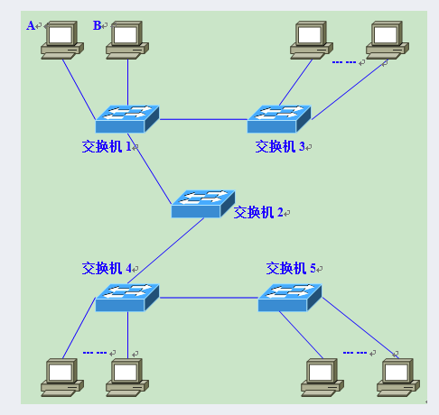

个由5台二层交换机（交换机1～5）连接了大量客户机构成的网络。假设这时，计算机A需要与计算机B通信。在基于以太网的通信中，必须在数据帧中指定目标MAC地址才能正常通信，因此计算机A必须先广播“ARP请求（ARP Request）信息”，来尝试获取计算机B的MAC地址。

交换机1收到广播帧（ARP请求）后，会将它转发给除接收端口外的其他所有端口，也就是Flooding了。接着，交换机2收到广播帧后也会Flooding。交换机3、4、5也还会Flooding。最终ARP请求会被转发到同一网络中的所有客户机上。

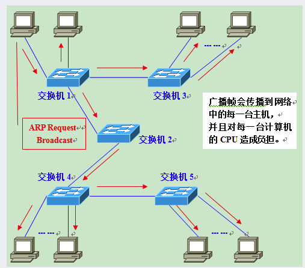

# 2. VLAN的实现机制
在理解了“为什么需要VLAN”之后，接下来让我们来了解一下交换机是如何使用VLAN分割广播域的。

首先，在一台未设置任何VLAN的二层交换机上，任何广播帧都会被转发给除接收端口外的所有其他端口（Flooding）。例如，计算机A发送广播信息后，会被转发给端口2、3、4。
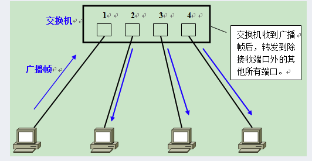

这时，如果在交换机上生成红、蓝两个VLAN；同时设置端口1、2属于红色VLAN、端口3、4属于蓝色VLAN。再从A发出广播帧的话，交换机就只会把它转发给同属于一个VLAN的其他端口——也就是同属于红色VLAN的端口2，不会再转发给属于蓝色VLAN的端口。

同样，C发送广播信息时，只会被转发给其他属于蓝色VLAN的端口，不会被转发给属于红色VLAN的端口。

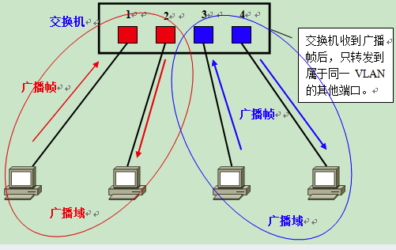

就这样，VLAN通过限制广播帧转发的范围分割了广播域。上图中为了便于说明，以红、蓝两色识别不同的VLAN，在实际使用中则是用“VLAN ID”来区分的。

## 2.1. 直观地描述VLAN
如果要更为直观地描述VLAN的话，我们可以把它理解为将一台交换机在逻辑上分割成了数台交换机。在一台交换机上生成红、蓝两个VLAN，也可以看作是将一台交换机换做一红一蓝两台虚拟的交换机。

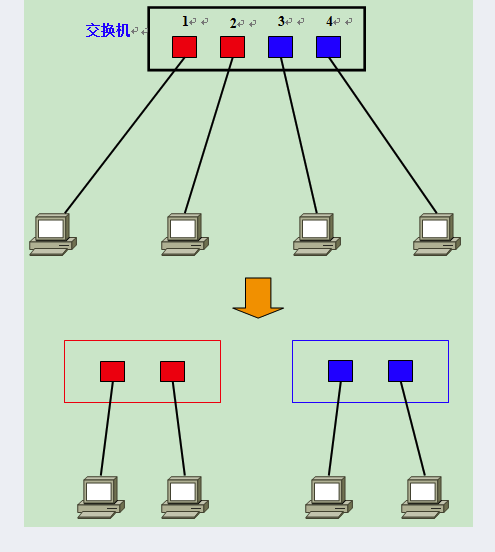
在红、蓝两个VLAN之外生成新的VLAN时，可以想象成又添加了新的交换机。

但是，VLAN生成的逻辑上的交换机是互不相通的。因此，在交换机上设置VLAN后，如果未做其他处理，VLAN间是无法通信的。

明明接在同一台交换机上，但却偏偏无法通信——这个事实也许让人难以接受。但它既是VLAN方便易用的特征，又是使VLAN令人难以理解的原因。

## 2.2. 需要VLAN间通信时怎么办
那么，当我们需要在不同的VLAN间通信时又该如何是好呢？

请大家再次回忆一下：VLAN是广播域。而通常两个广播域之间由路由器连接，广播域之间来往的数据包都是由路由器中继的。因此，VLAN间的通信也需要路由器提供中继服务，这被称作“VLAN间路由”。

VLAN间路由，可以使用普通的路由器，也可以使用三层交换机。其中的具体内容，等有机会再细说吧。在这里希望大家先记住不同VLAN间互相通信时需要用到路由功能。

# 3. VLAN的访问链接（Access Link）
## 3.1. 交换机的端口类型
交换机的端口，可以分为以下两种：

- 访问链接（Access Link）
- 汇聚链接（Trunk Link）

接下来就让我们来依次学习这两种不同端口的特征。这一讲，首先学习“访问链接”。

- 访问链接
访问链接，指的是“**只属于一个VLAN，且仅向该VLAN转发数据帧**”的端口。在大多数情况下，访问链接所连的是客户机。

通常设置VLAN的顺序是：

生成VLAN

设定访问链接（决定各端口属于哪一个VLAN）

设定访问链接的手法，可以是事先固定的、也可以是根据所连的计算机而动态改变设定。前者被称为“静态VLAN”、后者自然就是“动态VLAN”了。

### 3.1.1. 静态VLAN——基于端口

静态VLAN又被称为基于端口的VLAN（PortBased VLAN）。顾名思义，就是明确指定各端口属于哪个VLAN的设定方法。
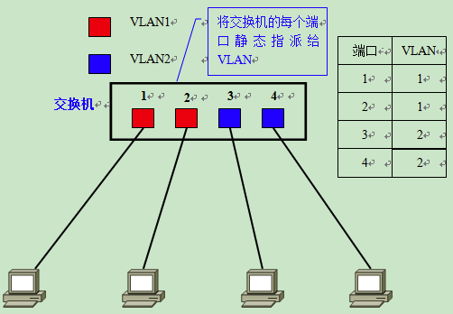

由于需要一个个端口地指定，因此当网络中的计算机数目超过一定数字（比如数百台）后，设定操作就会变得烦杂无比。并且，客户机每次变更所连端口，都必须同时更改该端口所属VLAN的设定——这显然不适合那些需要频繁改变拓补结构的网络。

### 3.1.2. 动态VLAN

另一方面，动态VLAN则是根据每个端口所连的计算机，随时改变端口所属的VLAN。这就可以避免上述的更改设定之类的操作。动态VLAN可以大致分为3类：

基于MAC地址的VLAN（MAC Based VLAN）

基于子网的VLAN（Subnet Based VLAN）

基于用户的VLAN（User Based VLAN）

其间的差异，主要在于根据OSI参照模型哪一层的信息决定端口所属的VLAN。

### 3.1.3. 基于MAC地址的VLAN

基于MAC地址的VLAN，就是通过查询并记录端口所连计算机上网卡的MAC地址来决定端口的所属。假定有一个MAC地址“A”被交换机设定为属于VLAN “10”，那么不论MAC地址为“A”的这台计算机连在交换机哪个端口，该端口都会被划分到VLAN 10中去。计算机连在端口1时，端口1属于VLAN 10；而计算机连在端口2时，则是端口2属于VLAN 10。

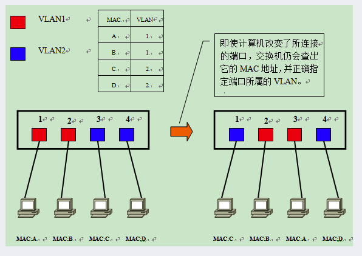

由于是基于MAC地址决定所属VLAN的，因此可以理解为这是一种在OSI的第二层设定访问链接的办法。

但是，基于MAC地址的VLAN，在设定时必须调查所连接的所有计算机的MAC地址并加以登录。而且如果计算机交换了网卡，还是需要更改设定。

### 3.1.4. 基于IP地址的VLAN

基于子网的VLAN，则是通过所连计算机的IP地址，来决定端口所属VLAN的。不像基于MAC地址的VLAN，即使计算机因为交换了网卡或是其他原因导致MAC地址改变，只要它的IP地址不变，就仍可以加入原先设定的VLAN。

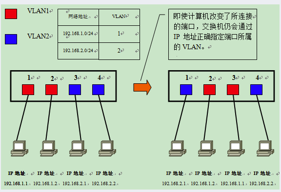

因此，与基于MAC地址的VLAN相比，能够更为简便地改变网络结构。IP地址是OSI参照模型中第三层的信息，所以我们可以理解为基于子网的VLAN是一种在OSI的第三层设定访问链接的方法。

基于用户的VLAN，则是根据交换机各端口所连的计算机上当前登录的用户，来决定该端口属于哪个VLAN。这里的用户识别信息，一般是计算机操作系统登录的用户，比如可以是Windows域中使用的用户名。这些用户名信息，属于OSI第四层以上的信息。

总的来说，决定端口所属VLAN时利用的信息在OSI中的层面越高，就越适于构建灵活多变的网络。

# 4. VLAN的汇聚链接（Trunk Link）
需要设置跨越多台交换机的VLAN时……
到此为止，我们学习的都是使用单台交换机设置VLAN时的情况。那么，如果需要设置跨越多台交换机的VLAN时又如何呢？

在规划企业级网络时，很有可能会遇到隶属于同一部门的用户分散在同一座建筑物中的不同楼层的情况，这时可能就需要考虑到如何跨越多台交换机设置VLAN的问题了。假设有如下图所示的网络，且需要将不同楼层的A、C和B、D设置为同一个VLAN。

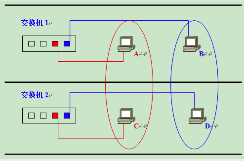

这时最关键的就是“交换机1和交换机2该如何连接才好呢？”

最简单的方法，自然是在交换机1和交换机2上各设一个红、蓝VLAN专用的接口并互联了。

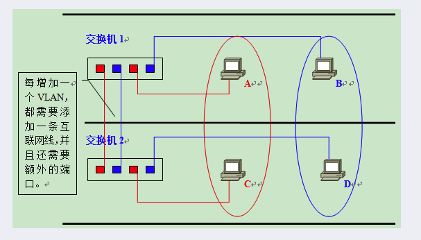

但是，这个办法从扩展性和管理效率来看都不好。例如，在现有网络基础上再新建VLAN时，为了让这个VLAN能够互通，就需要在交换机间连接新的网线。建筑物楼层间的纵向布线是比较麻烦的，一般不能由基层管理人员随意进行。并且，VLAN越多，楼层间（严格地说是交换机间）互联所需的端口也越来越多，交换机端口的利用效率低是对资源的一种浪费、也限制了网络的扩展。

为了避免这种低效率的连接方式，人们想办法让交换机间互联的网线集中到一根上，这时使用的就是汇聚链接（Trunk Link）。

## 4.1. 何谓汇聚链接
汇聚链接（Trunk Link）指的是能够转发多个不同VLAN的通信的端口。

汇聚链路上流通的数据帧，都被附加了用于识别分属于哪个VLAN的特殊信息。

现在再让我们回过头来考虑一下刚才那个网络如果采用汇聚链路又会如何呢？用户只需要简单地将交换机间互联的端口设定为汇聚链接就可以了。这时使用的网线还是普通的UTP线，而不是什么其他的特殊布线。图例中是交换机间互联，因此需要用交叉线来连接。

接下来，让我们具体看看汇聚链接是如何实现跨越交换机间的VLAN的。

A发送的数据帧从交换机1经过汇聚链路到达交换机2时，在数据帧上附加了表示属于红色VLAN的标记。

交换机2收到数据帧后，经过检查VLAN标识发现这个数据帧是属于红色VLAN的，因此去除标记后根据需要将复原的数据帧只转发给其他属于红色VLAN的端口。这时的转送，是指经过确认目标MAC地址并与MAC地址列表比对后只转发给目标MAC地址所连的端口。只有当数据帧是一个广播帧、多播帧或是目标不明的帧时，它才会被转发到所有属于红色VLAN的端口。

蓝色VLAN发送数据帧时的情形也与此相同。

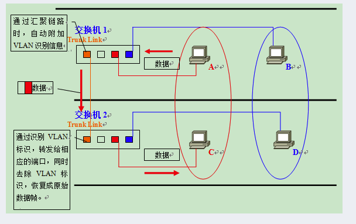

通过汇聚链路时附加的VLAN识别信息，有可能支持标准的“IEEE 802.1Q”协议，也可能是Cisco产品独有的“ISL（Inter Switch Link）”。如果交换机支持这些规格，那么用户就能够高效率地构筑横跨多台交换机的VLAN。

另外，汇聚链路上流通着多个VLAN的数据，自然负载较重。因此，在设定汇聚链接时，有一个前提就是必须支持100Mbps以上的传输速度。

另外，默认条件下，汇聚链接会转发交换机上存在的所有VLAN的数据。换一个角度看，可以认为汇聚链接（端口）同时属于交换机上所有的VLAN。由于实际应用中很可能并不需要转发所有VLAN的数据，因此为了减轻交换机的负载、也为了减少对带宽的浪费，我们可以通过用户设定限制能够经由汇聚链路互联的VLAN。

# 5. VLAN间路由
## 5.1. VLAN间路由的必要性
根据目前为止学习的知识，我们已经知道两台计算机即使连接在同一台交换机上，只要所属的VLAN不同就无法直接通信。接下来我们将要学习的就是如何在不同的VLAN间进行路由，使分属不同VLAN的主机能够互相通信。

首先，先来复习一下为什么不同VLAN间不通过路由就无法通信。在LAN内的通信，必须在数据帧头中指定通信目标的MAC地址。而为了获取MAC地址，TCP/IP协议下使用的是ARP。ARP解析MAC地址的方法，则是通过广播。也就是说，如果广播报文无法到达，那么就无从解析MAC地址，亦即无法直接通信。

计算机分属不同的VLAN，也就意味着分属不同的广播域，自然收不到彼此的广播报文。因此，属于不同VLAN的计算机之间无法直接互相通信。为了能够在VLAN间通信，需要利用OSI参照模型中更高一层——网络层的信息（IP地址）来进行路由。关于路由的具体内容，以后有机会再详细解说吧。

路由功能，一般主要由路由器提供。但在今天的局域网里，我们也经常利用带有路由功能的交换机——三层交换机（Layer 3 Switch）来实现。接下来就让我们分别看看使用路由器和三层交换机进行VLAN间路由时的情况。

## 5.2. 使用路由器进行VLAN间路由
在使用路由器进行VLAN间路由时，与构建横跨多台交换机的VLAN时的情况类似，我们还是会遇到“该如何连接路由器与交换机”这个问题。路由器和交换机的接线方式，大致有以下两种：

-  将路由器与交换机上的每个VLAN分别连接

- 不论VLAN有多少个，路由器与交换机都只用一条网线连接

最容易想到的，当然还是“把路由器和交换机以VLAN为单位分别用网线连接”了。将交换机上用于和路由器互联的每个端口设为访问链接（Access Link），然后分别用网线与路由器上的独立端口互联。如下图所示，交换机上有2个VLAN，那么就需要在交换机上预留2个端口用于与路由器互联；路由器上同样需要有2个端口；两者之间用2条网线分别连接。

如果采用这个办法，大家应该不难想象它的扩展性很成问题。每增加一个新的VLAN，都需要消耗路由器的端口和交换机上的访问链接，而且还需要重新布设一条网线。而路由器，通常不会带有太多LAN接口的。新建VLAN时，为了对应增加的VLAN所需的端口，就必须将路由器升级成带有多个LAN接口的高端产品，这部分成本、还有重新布线所带来的开销，都使得这种接线法成为一种不受欢迎的办法。

那么，第二种办法“不论VLAN数目多少，都只用一条网线连接路由器与交换机”呢？当使用一条网线连接路由器与交换机、进行VLAN间路由时，需要用到汇聚链接。

具体实现过程为：首先将用于连接路由器的交换机端口设为汇聚链接（Trunk Link），而路由器上的端口也必须支持汇聚链路。双方用于汇聚链路的协议自然也必须相同。接着在路由器上定义对应各个VLAN的“子接口”（Sub Interface）。尽管实际与交换机连接的物理端口只有一个，但在理论上我们可以把它分割为多个虚拟端口。

VLAN将交换机从逻辑上分割成了多台，因而用于VLAN间路由的路由器，也必须拥有分别对应各个VLAN的虚拟接口。

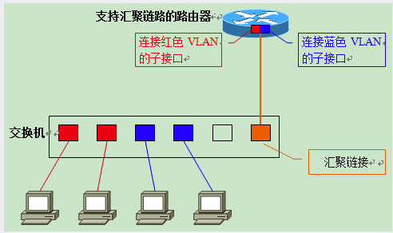

采用这种方法的话，即使之后在交换机上新建VLAN，仍只需要一条网线连接交换机和路由器。用户只需要在路由器上新设一个对应新VLAN的子接口就可以了。与前面的方法相比，扩展性要强得多，也不用担心需要升级LAN接口数不足的路由器或是重新布线。

## 5.3. 同一VLAN内的通信
接下来，我们继续学习使用汇聚链路连接交换机与路由器时，VLAN间路由是如何进行的。如下图所示，为各台计算机以及路由器的子接口设定IP地址。

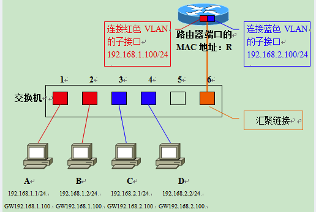

红色VLAN（VLAN ID=1）的网络地址为192.168.1.0/24，蓝色VLAN（VLAN ID=2）的网络地址为192.168.2.0/24。各计算机的MAC地址分别为A/B/C/D，路由器汇聚链接端口的MAC地址为R。交换机通过对各端口所连计算机MAC地址的学习，生成如下的MAC地址列表。

 

首先考虑计算机A与同一VLAN内的计算机B之间通信时的情形。

计算机A发出ARP请求信息，请求解析B的MAC地址。交换机收到数据帧后，检索MAC地址列表中与收信端口同属一个VLAN的表项。结果发现，计算机B连接在端口2上，于是交换机将数据帧转发给端口2，最终计算机B收到该帧。收发信双方同属一个VLAN之内的通信，一切处理均在交换机内完成。

## 5.4. 不同VLAN间的通信
接下来是这一讲的核心内容，不同VLAN间的通信。让我们来考虑一下计算机A与计算机C之间通信时的情况。

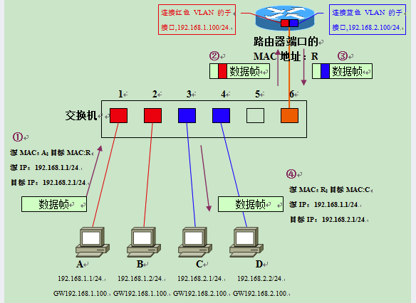

计算机A从通信目标的IP地址（192.168.2.1）得出C与本机不属于同一个网段。因此会向设定的默认网关（DefaultGateway，GW）转发数据帧。在发送数据帧之前，需要先用ARP获取路由器的MAC地址。

得到路由器的MAC地址R后，接下来就是按图中所示的步骤发送往C去的数据帧。①的数据帧中，目标MAC地址是路由器的地址R、但内含的目标IP地址仍是最终要通信的对象C的地址。这一部分的内容，涉及到局域网内经过路由器转发时的通信步骤，有机会再详细解说吧。

交换机在端口1上收到①的数据帧后，检索MAC地址列表中与端口1同属一个VLAN的表项。由于汇聚链路会被看作属于所有的VLAN，因此这时交换机的端口6也属于被参照对象。这样交换机就知道往MAC地址R发送数据帧，需要经过端口6转发。

从端口6发送数据帧时，由于它是汇聚链接，因此会被附加上VLAN识别信息。由于原先是来自红色VLAN的数据帧，因此如图中②所示，会被加上红色VLAN的识别信息后进入汇聚链路。路由器收到②的数据帧后，确认其VLAN识别信息，由于它是属于红色VLAN的数据帧，因此交由负责红色VLAN的子接口接收。

接着，根据路由器内部的路由表，判断该向哪里中继。

由于目标网络192.168.2.0/24是蓝色VLAN，，且该网络通过子接口与路由器直连，因此只要从负责蓝色VLAN的子接口转发就可以了。这时，数据帧的目标MAC地址被改写成计算机C的目标地址；并且由于需要经过汇聚链路转发，因此被附加了属于蓝色VLAN的识别信息。这就是图中③的数据帧。

交换机收到③的数据帧后，根据VLAN标识信息从MAC地址列表中检索属于蓝色VLAN的表项。由于通信目标——计算机C连接在端口3上、且端口3为普通的访问链接，因此交换机会将数据帧去除VLAN识别信息后（数据帧④）转发给端口3，最终计算机C才能成功地收到这个数据帧。

进行VLAN间通信时，即使通信双方都连接在同一台交换机上，也必须经过：“发送方——交换机——路由器——交换机——接收方”这样一个流程。

 