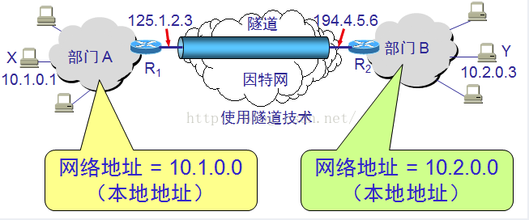

# 1. VPN是什么
VPN(全称Virtual Private Network)虚拟专用网络，是依靠ISP和其他的NSP，在公共网络中建立专用的数据通信网络的技术，可以为企业之间或者个人与企业之间提供安全的数据传输隧道服务。在VPN中任意两点之间的连接并没有传统专网所需的端到端的物理链路，而是利用公共网络资源动态组成的，可以理解为通过私有的隧道技术在公共数据网络上模拟出来的和专网有同样功能的点到点的专线技术
# 2. 主要应用场景
## 2.1. 出差在外访问公司内部资源
企业内部员工出差、休假或特殊情况下在远离办公室的时候，又有需求访问公司的内部网络获取相关资源，就可以通过VPN拨号到公司内部。此时远程拨号的员工和办公室内的员工以及其他拨号的员工之间都相当于在一个局域网内。例如：访问内部的域控制器，文件服务器，OA系统，ERP，HTTP服务，内网飞秋聊天工具等局域网服务应用。

运维人员需要个人电脑远程拨号到企业网站的IDC机房，远程维护IDC内网服务器。

- 外出办公的人如何连接内网服务器呢？

没有VPN
先登录到外网服务器组中一台服务器，然后在这个外网服务器上SSH到内网服务器。
有VPN
把VPN搭在某一台外网服务器(外网服务器有公网ip)上，这样外出办公人员可以通过vpn拨号到这台机器上，然后在自己笔记本上输入内网服务器的IP:port访问内网服务器。同时有了vpn，可以把外网服务器的远程连接SSH全部屏蔽起来，黑客就不能通过SSH服务来攻击公司的外网服务器。而公司的人员通过vpn拨号拨到这个装了vpn的外网服务器上去，然后访问内网服务器。访问外网服务器通过访问内网ip地址去访问。
## 2.2. 企业内部网络之间VPN服务
在公司的分支机构的局域网和公司内部LAN之间的VPN连接。通过公网Internet建立VPN将公司在各地的分支机构的LAN连接到公司总部的LAN。例如：各大超市之间业务结算等。

这是由于地域的原因而产生的VPN需求，通过VPN让不同地域内的机器可以互相访问，就好像是一个局域网一样。例如：办公室互联协同办公，机房互联数据同步及业务访问。

## 2.3. 互联网公司多IDC机房之间VPN服务
这是运维架构人员需要考虑的问题，不同机房之间业务管理和业务访问，数据流动。

## 2.4. 企业外部VPN服务
在供应商、合作伙伴的LAN和本公司的LAN之间建立的VPN服务。

企业内部网络之间的VPN服务、企业内部网络之间VPN服务和企业外部VPN服务是一套系统，不同的场景。

翻墙
翻墙的原理：比如有个VPS，有美国的ip地址。各位的笔记本或台式机通过vpn访问到美国的vps的机器，然后通过这个vitual private server出去访问美国的网站。在网站看来，你的源ip是美国的vps的地址，而你笔记本和vps之间的通信是加密的，走的是vpn协议。vps和后端的网站之间走的是http协议

# 3. 原理
假如一个机构没有接入因特网，但是内部的计算机通信也是采用TCP/IP协议，那么从原则上讲，对于这些仅在机构内部使用的计算机就可以由本机构自行分配IP地址（这种地址称为本地地址）。

但是，如果任意选择一些IP地址作为本机构内部使用的本地地址，那么在某种情况下可能会引起一些麻烦。例如，有时机构内部的某个主机需要和因特网连接，那么这种仅在内部使用的本地地址就可能和因特网中某个IP地址重合。

为解决这一问题，IP地址中保留了一些专用地址，只能用于机构的内部通信，而不能用于因特网上的主机通信。因特网中的所有路由器，对目的地址是专用地址的数据报一律不进行转发。

这些专用地址如下：

10.0.0.0 到10.255.255.255

172.16.0.0 到172.31.255.255

192.168.0.0 到 192.168.255.255

采用这样的专用IP地址的互联网称为专用互联网或本地互联网。

有时一个很大的机构有许多部门分布在相距很远的一些地点，而每一个地点都有自己的专用网。假如这些分布在不同地点的专用网需要经常通信，有两种解决办法，一是租用电信公司的通信线路为本机构专用，但是往往租金太高。二是利用公用的因特网作为本机构各专用网之间的通信载体，这样的专用网又称虚拟专用网VPN（Virtual Private Network）。

假定某机构在两个相隔较远的场所建立了专用网A和B，其网络地址分别为专用地址10.1.0.0和10.2.0.0。现在，这两个场所需要通过公用的互联网构成一个VPN。

显然，每一个场所至少要有一个路由器具有合法的全球IP地址，这两个路由器和因特网的接口地址是全球IP地址，和内部网络的接口地址则是专用网的本地地址。

有的公司可能没有分布在不同场所的部门，但有很多流动员工在外地工作。公司需要和他们保持联系，远程接入 VPN 可满足这种需求。

在外地工作的员工拨号接入因特网，而驻留在员工 PC 机中的 VPN 软件可在员工的 PC 机和公司的主机之间建立 VPN 隧道，因而外地员工与公司通信的内容是保密的，员工们感到好像就是使用公司内部的本地网络。

# 4. 网络地址转换NAT
网络地址转换NAT (Network Address Translation)方法需要在专用网连接到因特网的路由器上安装 NAT 软件。装有 NAT 软件的路由器叫做NAT路由器，它至少有一个有效的外部全球地址IP。

内部主机 X 用本地地址 IPx和因特网上主机 Y 通信所发送的数据报必须经过 NAT 路由器。

NAT 路由器将数据报的源地址IPX 转换成全球地址 IPG，但目的地址 IPY 保持不变，然后发送到因特网。

NAT 路由器收到主机 Y 发回的数据报时，知道数据报中的源地址是 IPY 而目的地址是 IPG。

根据 NAT 转换表，NAT 路由器将目的地址 IPG转换为 IPX，转发给最终的内部主机 X。

这样就可以是专用网内较多数量的主机，轮流使用NAT路由器有限数量的全球IP地址。

显然，通过NAT路由器通信必须由专用网内的主机发起，设想因特网上的主机发起通信，当IP数据报到达NAT路由器时，NAT路由器就不知道应当把目的IP地址转换成哪一个本地地址，所以专用网内部的主机不能充当服务器用，因为因特网上的用户无法请求服务。

