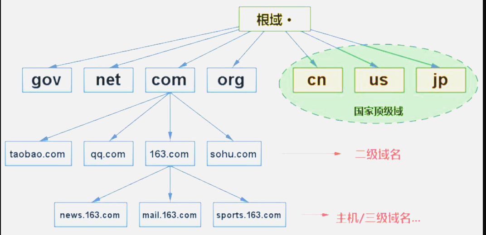
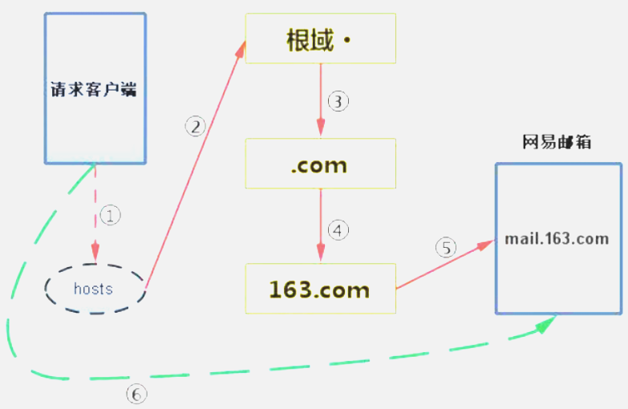

# 1. URL
 URL：(UniformResource Locator)统一资源定位符。 
 URL类的常用方法： 
```String getFile()：获取此 URL的文件名。
   String getHost()：获取此 URL的主机名（如果适用）。
   String getPath()：获取此 URL的路径部分。
   int getPort()：获取此 URL的端口号。当返回值为-1的时候，表示使用http协议默认的端口号：80
   String getProtocol()：获取此 URL的协议名称。
   String getQuery()：获取此 URL的查询部分。（获取web路径之后的具体参数信息）
    URLConnection openConnection()：返回一个URLConnection 对象，它表示到URL 所引用的远程对象的连接。
```
# 2. “域名解析”介绍
- DNS：Domain Name System域名系统。是域名和IP地址的一种映射关系。

- DNS的作用：可以将域名解析成IP地址，方便记忆。（现实生活中一般以十进制的形式来表示IP地址，但是由于IP地址都是由数字组成，位数较多不易记忆，所以通过将域名和IP地址产生对应关系，而域名比较容易记忆，通过DNS服务来实现访问域名达到访问指定IP地址主机的效果）

## 2.1. 浏览器访问互联网主机的步骤（概述）：

①．当使用浏览器访问一个网页的时候，本机首先查找本地hosts文件，如果本地hosts文件中有映射关系，则优先访问hosts文件中的域名对应的主机IP地址。

②．当本地hosts中没有相应的映射关系的时候，本机会向所在网络的DNS服务器请求要访问的网页。如果本地DNS服务器能找到要访问的网页主机，则将相应的信息反馈给请求端。如果没有找到，则本地DNS服务器继续向根域DNS服务器发出请求。

③、以访问网易邮箱mail.163.com为例：当本地DNS服务器向根DNS服务器请求时，根DNS服务器如果不知道网易主机的IP地址，但是却知道网易主机所在的域.com，接下来就告诉请求端去.com所在的顶级域中查找。

④、当向.com所在域的DNS服务器请求mail.163.com时，如果在.com域的DNS服务器中查不到的，但是可以告诉请求端去163.com这个二级域名所在域的DNS服务器中查找需要的信息。

⑤、而163.com这个域所在的DNS主机下面正好有mail.163.com这台主机，则此时便将要请求的主机IP地址告诉请求端，然后请求端直接通过该获取到的IP地址等信息去访问指定的邮箱资源。


# 3. Http和Https的区别？
答：Http协议运行在TCP之上，明文传输，客户端与服务器端都无法验证对方的身份；Https是身披SSL(Secure Socket Layer)外壳的Http，运行于SSL上，SSL运行于TCP之上，是添加了加密和认证机制的HTTP。二者之间存在如下不同：

- 端口不同：Http与Https使用不同的连接方式，用的端口也不一样，前者是80，后者是443；
- 资源消耗：和HTTP通信相比，Https通信会由于加减密处理消耗更多的CPU和内存资源；
- 开销：Https通信需要证书，而证书一般需要向认证机构购买；

Https的加密机制是一种共享密钥加密和公开密钥加密并用的混合加密机制。

# 4. GET 与 POST 的区别？
答：GET与POST是我们常用的两种HTTP Method，二者之间的区别主要包括如下五个方面：
(1). 从功能上讲，GET一般用来从服务器上获取资源，POST一般用来更新服务器上的资源；
(2). 从REST服务角度上说，GET是幂等的，即读取同一个资源，总是得到相同的数据，而POST不是幂等的，因为每次请求对资源的改变并不是相同的；进一步地，GET不会改变服务器上的资源，而POST会对服务器资源进行改变；
(3). 从请求参数形式上看，GET请求的数据会附在URL之后，即将请求数据放置在HTTP报文的 请求头 中，以?分割URL和传输数据，参数之间以&相连。特别地，如果数据是英文字母/数字，原样发送；否则，会将其编码为 application/x-www-form-urlencoded MIME 字符串(如果是空格，转换为+，如果是中文/其他字符，则直接把字符串用BASE64加密，得出如：%E4%BD%A0%E5%A5%BD，其中％XX中的XX为该符号以16进制表示的ASCII)；而POST请求会把提交的数据则放置在是HTTP请求报文的 请求体 中。
(4). 就安全性而言，POST的安全性要比GET的安全性高，因为GET请求提交的数据将明文出现在URL上，而且POST请求参数则被包装到请求体中，相对更安全。
(5). 从请求的大小看，GET请求的长度受限于浏览器或服务器对URL长度的限制，允许发送的数据量比较小，而POST请求则是没有大小限制的。

