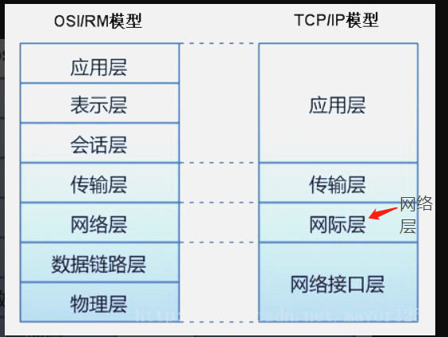
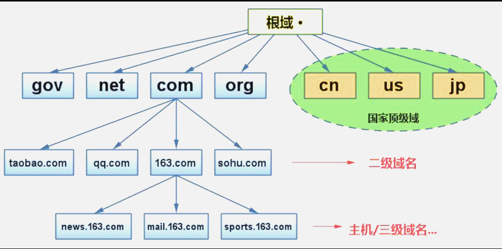
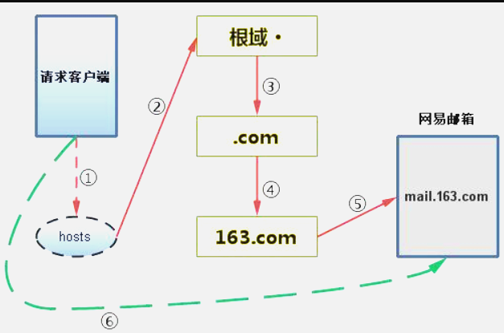

# 1. 简单的网络知识
## 1.1. 网络模型： 
①、OSI/RM（Open System Interconnection Reference Model开放式系统互连基本参考模型），是由ISO（International Standards Organization国际标准化组织）提出的网络参考模型。

②、TCP/IP（Transmission Control Protocol/Internet Protocol 传输控制协议/因特网互联协议）

③、两种网络模型的主要区别： 
OSI/RM：7层模型。从低到高分别是：物理层、数据链路层、网络层、传输层、会话层、表示层、应用层 
OSI/RM模型的网络层同时支持面向连接和无连接的通信，但是传输层只支持面向连接的通信。 
TCP/IP：4层模型。从低到高分别是：网络接口层、网络层、传输层、应用层 
TCP/IP模型的网络层只提供无连接的服务，但是传输层上同时提供两种通信模式。

## 1.2. OSI的7层模型　
- 物理层（Physical Layer）
　　
　　物理层规定了激活、维持、关闭通信端点之间的机械特性、电气特性、功能特性以及过程特性。该层为上层协议提供了一个传输数据的物理媒体。
　　
　　在这一层，数据的单位称为比特（bit）。
　　
　　属于物理层定义的典型规范代表包括：EIA/TIA RS-232、EIA/TIA RS-449、V.35、RJ-45等。
　　
- 数据链路层（Data Link Layer）
　　
　　数据链路层在不可靠的物理介质上提供可靠的传输。该层的作用包括：物理地址寻址、数据的成帧、流量控制、数据的检错、重发等。
　　
　　在这一层，数据的单位称为帧（frame）。
　　
　　数据链路层协议的代表包括：SDLC、HDLC、PPP、STP、帧中继等。
　　
- 网络层（Network Layer）
　　
　　网络层负责对子网间的数据包进行路由选择。此外，网络层还可以实现拥塞控制、网际互连等功能。
　　
　　在这一层，数据的单位称为数据包（packet）。
　　
　　网络层协议的代表包括：IP、IPX、RIP、OSPF等。
　　
- 传输层（Transport Layer）
　　
　　传输层是第一个端到端，即主机到主机的层次。传输层负责将上层数据分段并提供端到端的、可靠的或不可靠的传输。此外，传输层还要处理端到端的差错控制和流量控制问题。
　　
　　在这一层，数据的单位称为数据段（segment）。
　　
　　传输层协议的代表包括：TCP、UDP、SPX等。
　　
- 会话层（Session Layer）
　　
　　会话层管理主机之间的会话进程，即负责建立、管理、终止进程之间的会话。会话层还利用在数据中插入校验点来实现数据的同步。
　　
　　会话层协议的代表包括：NetBIOS、ZIP（AppleTalk区域信息协议）等。
　　
- 表示层（Presentation Layer）
　　
　　表示层对上层数据或信息进行变换以保证一个主机应用层信息可以被另一个主机的应用程序理解。表示层的数据转换包括数据的加密、压缩、格式转换等。
　　
　　表示层协议的代表包括：ASCII、ASN.1、JPEG、MPEG等。
　　
- 应用层（Application Layer）
　　
　　应用层为操作系统或网络应用程序提供访问网络服务的接口。
　　
　　应用层协议的代表包括：Telnet、FTP、HTTP、SNMP等。

## 1.3. TCP/IP的四层
- 主机到网络层
　　
　　实际上TCP/IP参考模型没有真正描述这一层的实现，只是要求能够提供给其上层-网络互连层一个访问接口，以便在其上传递IP分组。由于这一层次未被定义，所以其具体的实现方法将随着网络类型的不同而不同。
　　
- 网络互连层
　　
　　网络互连层是整个TCP/IP协议栈的核心。它的功能是把分组发往目标网络或主机。同时，为了尽快地发送分组，可能需要沿不同的路径同时进行分组传递。因此，分组到达的顺序和发送的顺序可能不同，这就需要上层必须对分组进行排序。
　　
　　网络互连层定义了分组格式和协议，即IP协议（Internet Protocol）。
　　
　　网络互连层除了需要完成路由的功能外，也可以完成将不同类型的网络（异构网）互连的任务。除此之外，网络互连层还需要完成拥塞控制的功能。
　　
- 传输层
## 1.4. TCP/IP传输协议
　　在TCP/IP模型中，传输层的功能是使源端主机和目标端主机上的对等实体可以进行会话。在传输层定义了两种服务质量不同的协议。即：传输控制协议TCP（transmission control protocol）和用户数据报协议UDP（user datagram protocol）。
　　
　　TCP协议是一个面向连接的、可靠的协议。它将一台主机发出的字节流无差错地发往互联网上的其他主机。在发送端，它负责把上层传送下来的字节流分成报文段并传递给下层。在接收端，它负责把收到的报文进行重组后递交给上层。TCP协议还要处理端到端的流量控制，以避免缓慢接收的接收方没有足够的缓冲区接收发送方发送的大量数据。
　　
　　UDP协议是一个不可靠的、无连接协议，主要适用于不需要对报文进行排序和流量控制的场合。
　　
- 应用层
　　
　　TCP/IP模型将OSI参考模型中的会话层和表示层的功能合并到应用层实现。
　　
　　应用层面向不同的网络应用引入了不同的应用层协议。其中，有基于TCP协议的，如 文件传输协议（File Transfer Protocol，FTP）、虚拟终端协议（TELNET）、超文本链接协议（Hyper Text Transfer Protocol，HTTP），也有基于UDP协议的，如 简易邮件传输通讯协议(Simple Mail Transfer Protocol)、TELNET及USERNET命令等等。

 传输协议TCP和UDP 
①、UDP：User Datagram Protocol用户数据报协议 
特点： 
面向无连接：传输数据之前源端和目的端不需要建立连接。 
每个数据报的大小都限制在64K（8个字节）以内。 
面向报文的不可靠协议。（即：发送出去的数据不一定会接收得到） 
传输速率快，效率高。 
现实生活实例：邮局寄件、实时在线聊天、视频会议…等。

②、TCP：Transmission Control Protocol传输控制协议 
特点： 
面向连接：传输数据之前需要建立连接。 
在连接过程中进行大量数据传输。 
通过“三次握手”的方式完成连接，是安全可靠协议。 
传输速度慢，效率低。 
现实生活实例：打电话、下载文件…等。

小知识点：TCP有6种标志位：SYN（建立联机）、ACK（确认）、PSH（传送）、FIN（结束）、RST（重置）、URG（紧急） 
Sequence number(顺序号码)Acknowledge number(确认号码)
# 2. URL
 URL：(UniformResource Locator)统一资源定位符。 
 URL类的常用方法： 
```String getFile()：获取此 URL的文件名。
   String getHost()：获取此 URL的主机名（如果适用）。
   String getPath()：获取此 URL的路径部分。
   int getPort()：获取此 URL的端口号。当返回值为-1的时候，表示使用http协议默认的端口号：80
   String getProtocol()：获取此 URL的协议名称。
   String getQuery()：获取此 URL的查询部分。（获取web路径之后的具体参数信息）
    URLConnection openConnection()：返回一个URLConnection 对象，它表示到URL 所引用的远程对象的连接。
```
# 3. “域名解析”介绍
- DNS：Domain Name System域名系统。是域名和IP地址的一种映射关系。

- DNS的作用：可以将域名解析成IP地址，方便记忆。（现实生活中一般以十进制的形式来表示IP地址，但是由于IP地址都是由数字组成，位数较多不易记忆，所以通过将域名和IP地址产生对应关系，而域名比较容易记忆，通过DNS服务来实现访问域名达到访问指定IP地址主机的效果）
- 
## 3.1. 浏览器访问互联网主机的步骤（概述）：

①．当使用浏览器访问一个网页的时候，本机首先查找本地hosts文件，如果本地hosts文件中有映射关系，则优先访问hosts文件中的域名对应的主机IP地址。

②．当本地hosts中没有相应的映射关系的时候，本机会向所在网络的DNS服务器请求要访问的网页。如果本地DNS服务器能找到要访问的网页主机，则将相应的信息反馈给请求端。如果没有找到，则本地DNS服务器继续向根域DNS服务器发出请求。

③、以访问网易邮箱mail.163.com为例：当本地DNS服务器向根DNS服务器请求时，根DNS服务器如果不知道网易主机的IP地址，但是却知道网易主机所在的域.com，接下来就告诉请求端去.com所在的顶级域中查找。

④、当向.com所在域的DNS服务器请求mail.163.com时，如果在.com域的DNS服务器中查不到的，但是可以告诉请求端去163.com这个二级域名所在域的DNS服务器中查找需要的信息。

⑤、而163.com这个域所在的DNS主机下面正好有mail.163.com这台主机，则此时便将要请求的主机IP地址告诉请求端，然后请求端直接通过该获取到的IP地址等信息去访问指定的邮箱资源。
