# 1. TCP/IP传输协议
　　在TCP/IP模型中，传输层的功能是使源端主机和目标端主机上的对等实体可以进行会话。在传输层定义了两种服务质量不同的协议。即：传输控制协议TCP（transmission control protocol）和用户数据报协议UDP（user datagram protocol）。
　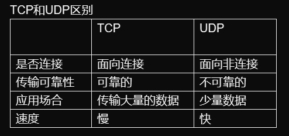
　　
# 2. TCP
TCP：Transmission Control Protocol传输控制协议 
　　TCP协议是一个面向连接的、可靠的协议。它将一台主机发出的字节流无差错地发往互联网上的其他主机。在发送端，它负责把上层传送下来的字节流分成报文段并传递给下层。在接收端，它负责把收到的报文进行重组后递交给上层。TCP协议还要处理端到端的流量控制，以避免缓慢接收的接收方没有足够的缓冲区接收发送方发送的大量数据。

## 2.1. TCP的工作流程
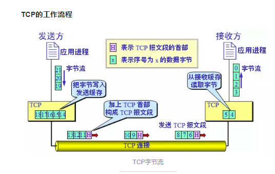

## 2.2. TCP报文的头部
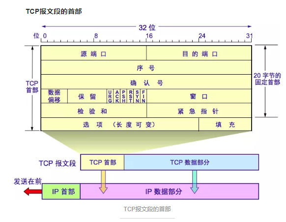

源端口和目的端口 : 同UDP端口作用
序号 : 本报文段的数据的第一个字节的序号
确认号 : 期望收到对方下一个报文段的第一个数据字节的序号
若确认号 = N, 则表明 : 到序号N-1为止的所有数据都已正常收到

数据偏移 : TCP报文段的首部长度
保留 : 以后用, 目前为0
紧急URG : 若URG = 1时, 说明紧急指针字段有效, 告诉系统这是紧急数据, 应尽快传送. 例如突然要中断传送
确认ACK : ACK = 1时确认号才有效, ACK = 0时确认号无效. TCP规定, 连接建立后所有传送的报文段都必须把ACK置1
推送PSH : 若PSH = 1, 则接收方收到报文段之后不再等到整个缓存满而是直接向上交付
复位RST : 当RST = 1, 说明TCP连接有严重错误, 必须释放连接再重连
同步SYN : 在连接建立时用来同步序号. 当SYN = 1, ACK = 0时表明这是一个连接请求报文段, 对方若同意建立连接, 则在响应的报文段中置SYN = 1, ACK = 1
终止FIN : 当FIN = 1, 表明此报文段的发送方数据已发送完毕, 并要求释放连接
窗口 : 告诉对方 : 从本报文段首部中的确认号算起, 接收方目前允许对方发送的数据量. 这是作为接收方让发送方设置其发送窗口的依据
检验和 : 同UDP, 检验首部和数据部分
紧急指针 : 当URG = 1时有效, 指出紧急数据的末尾在报文段的位置
选项 : 最大可40字节, 没有则为0
最大报文段长度MSS(Maximum Segment Size) : 每一个TCP报文段中数据字段的最大长度, 若不填写则为默认的536字节.

## 2.3. 特点： 
- 面向连接：传输数据之前需要建立连接。 在连接过程中进行大量数据传输。 通过“三次握手”的方式完成连接，是安全可靠协议。 
- 传输速度慢，效率低。 
- 现实生活实例：打电话、下载文件…等。
# 3. UDP
　   UDP协议是一个不可靠的、无连接协议，主要适用于不需要对报文进行排序和流量控制的场合。面向非连接、传输不可靠、用于传输少量数据(数据包模式)、速度快、TCP面向字节流，实际上是TCP把数据看成一连串无结构的字节流;UDP是面向报文的
## 3.1. UDP的首部
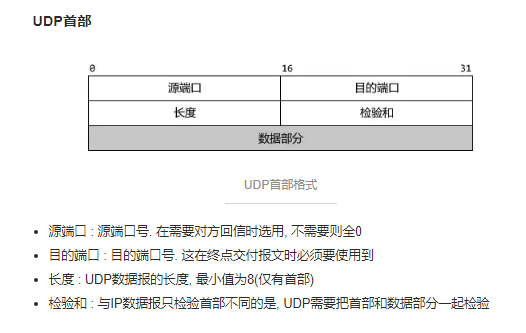
## 3.2. 特点 
- UDP：User Datagram Protocol用户数据报协议
- 特点： 面向无连接：传输数据之前源端和目的端不需要建立连接。 每个数据报的大小都限制在64K（8个字节）以内。 面向报文的不可靠协议。（即：发送出去的数据不一定会接收得到） 传输速率快，效率高。 
- 现实生活实例：邮局寄件、实时在线聊天、视频会议…等

# 4. 区别
TCP (Transmission Control Protocol)和UDP(User Datagram Protocol)协议属于传输层协议，它们之间的区别包括：

TCP是面向连接的，UDP是无连接的；
TCP是可靠的，UDP是不可靠的；
TCP只支持点对点通信，UDP支持一对一、一对多、多对一、多对多的通信模式；
TCP是面向字节流的，UDP是面向报文的；
TCP有拥塞控制机制;UDP没有拥塞控制，适合媒体通信；
TCP首部开销(20个字节)比UDP的首部开销(8个字节)要大；

# 5. TCP的三次握手
tcp的6种标志位的分别代表：
SYN(synchronous建立联机)
ACK(acknowledgement 确认)
PSH(push传送)
FIN(finish结束)
RST(reset重置)
URG(urgent紧急)
Sequence number(顺序号码)
Acknowledge number(确认号码)
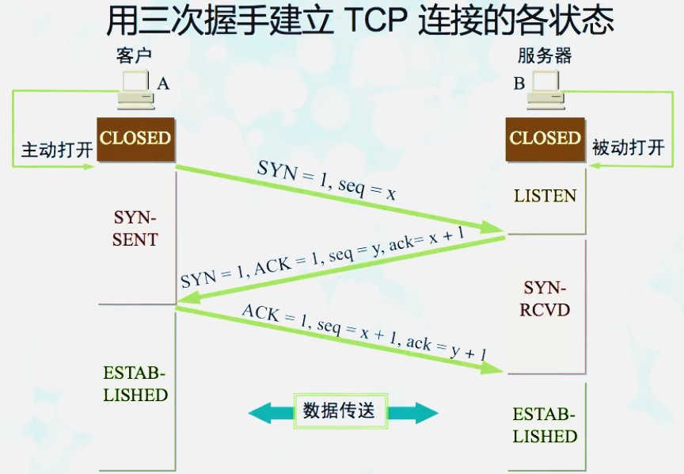

- 第一次握手：Client将标志位SYN置为1，随机产生一个值seq=J，并将该数据包发送给Server，Client进入SYN_SENT状态，等待Server确认。

- 第二次握手：Server收到数据包后由标志位SYN=1知道Client请求建立连接，Server将标志位SYN和ACK都置为1，ack=J+1，随机产生一个值seq=K，并将该数据包发送给Client以确认连接请求，Server进入SYN_RCVD状态。

- 第三次握手：Client收到确认后，检查ack是否为J+1，ACK是否为1，如果正确则将标志位ACK置为1，ack=K+1，并将该数据包发送给Server，Server检查ack是否为K+1，ACK是否为1，如果正确则连接建立成功，Client和Server进入ESTABLISHED状态，完成三次握手，随后Client与Server之间可以开始传输数据了
## 5.1. 为什么要三次握手
现假定出现了一种异常情况：即 A 发出的第一个连接请求报文段并没有丢失，而是在某个网络结点长时间的滞留了，以致延误到连接释放以后的某个时间才到达 B。本来这是一个早已失效的报文段。但 B 收到此失效的连接请求报文段后，就误认为是 A 再次发出的一个新的连接请求。于是就向 A 发出确认报文段，同意建立连接。

假设不采用“三次握手”，那么只要 B 发出确认，新的连接就建立了。由于现在 A 并没有发出建立连接的请求，因此不会理睬 B 的确认，也不会向 B 发送数据。但 B 却以为新的运输连接已经建立，并一直等待 A 发来数据。这样，B 的很多资源就白白浪费掉了。采用“三次握手”的办法可以防止上述现象发生

# 6. TCP的四次挥手
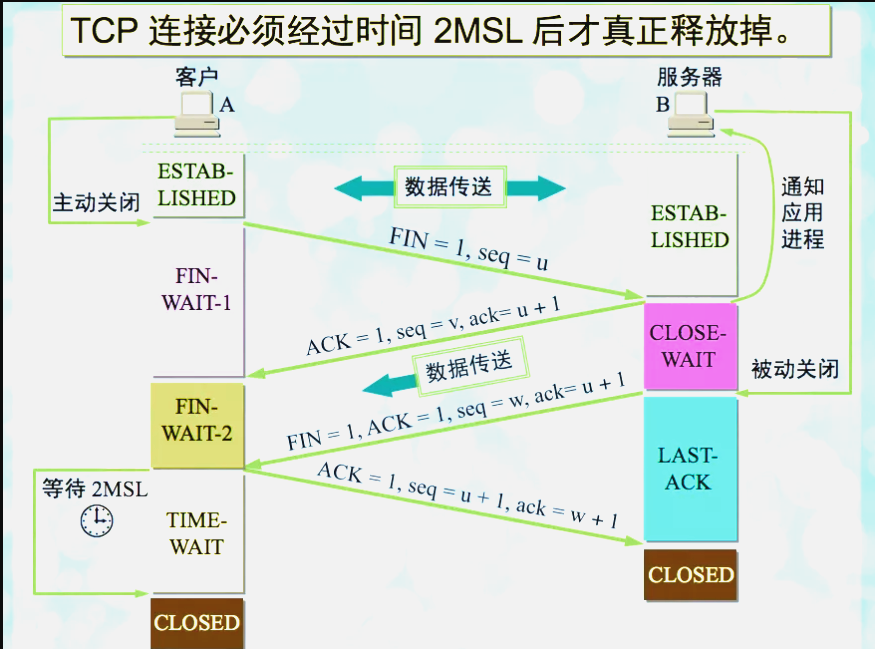

四次挥手（我要和你断开链接；好的，断吧。我也要和你断开链接；好的，断吧）：

- 第一次挥手：Client发送一个FIN，用来关闭Client到Server的数据传送，Client进入FIN_WAIT_1状态。

- 第二次挥手：Server收到FIN后，发送一个ACK给Client，确认序号为收到序号+1（与SYN相同，一个FIN占用一个序号），Server进入CLOSE_WAIT状态。此时TCP链接处于半关闭状态，即客户端已经没有要发送的数据了，但服务端若发送数据，则客户端仍要接收。

- 第三次挥手：Server发送一个FIN，用来关闭Server到Client的数据传送，Server进入LAST_ACK状态。

- 第四次挥手：Client收到FIN后，Client进入TIME_WAIT状态，接着发送一个ACK给Server，确认序号为收到序号+1，Server进入CLOSED状态，完成四次挥手

## 6.1. 为什么要四次挥手
答：TCP 协议是一种面向连接的、可靠的、基于字节流的运输层通信协议。TCP 是全双工模式，这就意味着，当 A 向 B 发出 FIN 报文段时，只是表示 A 已经没有数据要发送了，而此时 A 还是能够接受到来自 B 发出的数据；B 向 A 发出 ACK 报文段也只是告诉 A ，它自己知道 A 没有数据要发了，但 B 还是能够向 A 发送数据。
所以想要愉快的结束这次对话就需要四次挥手

# 7. TCP 协议如何来保证传输的可靠性
答：TCP 提供一种面向连接的、可靠的字节流服务。其中，面向连接意味着两个使用 TCP 的应用（通常是一个客户和一个服务器）在彼此交换数据之前必须先建立一个 TCP 连接。在一个 TCP 连接中，仅有两方进行彼此通信；而字节流服务意味着两个应用程序通过 TCP 链接交换 8 bit 字节构成的字节流，TCP 不在字节流中插入记录标识符。
对于可靠性，TCP通过以下方式进行保证：

- 数据包校验：目的是检测数据在传输过程中的任何变化，若校验出包有错，则丢弃报文段并且不给出响应，这时TCP发送数据端超时后会重发数据；
对失序数据包重排序：既然TCP报文段作为IP数据报来传输，而IP数据报的到达可能会失序，因此TCP报文段的到达也可能会失序。TCP将对失序数据进行重新排序，然后才交给应用层；
- 丢弃重复数据：对于重复数据，能够丢弃重复数据；
- 应答机制：当TCP收到发自TCP连接另一端的数据，它将发送一个确认。这个确认不是立即发送，通常将推迟几分之一秒；
- 超时重发：当TCP发出一个段后，它启动一个定时器，等待目的端确认收到这个报文段。如果不能及时收到一个确认，将重发这个报文段；
- 流量控制：TCP连接的每一方都有固定大小的缓冲空间。TCP的接收端只允许另一端发送接收端缓冲区所能接纳的数据，这可以防止较快主机致使较慢主机的缓冲区溢出，这就是流量控制。TCP使用的流量控制协议是可变大小的滑动窗口协议
# 8. 滑动窗口机制
在TCP/IP协议栈中，滑动窗口的引入可以解决此问题，先来看从概念上数据分为哪些类
## 8.1. 滑动窗口的分类
- 第一类：发送且被确认（19个字节）
- 第二类：已发送到但未收到确认（9个字节）
- 第三类：尚未发送但接收端准备好接受（6个字节）
- 第四类：尚未发送，且接受方没有做好准备（50个字节）
## 8.2. 可用窗口和发送窗口
- 发送窗口：（第二类和第三类窗口字节数之和）
- 可用窗口：（第三类字节数）
# 9. 滑动窗口原理
如：
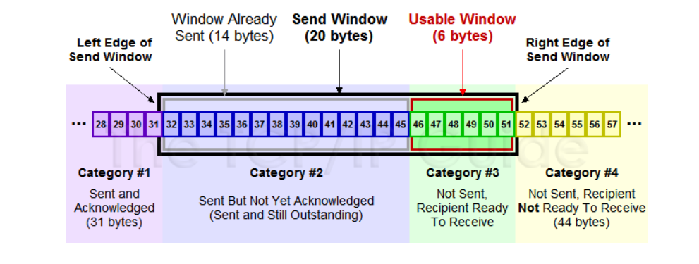
假设32~45 这些数据，是上层Application发送给TCP的，TCP将其分成四个Segment来发往internet

- seg1 32~34 seg3 35~36 seg3 37~41 seg4 42~45  这四个片段，依次发送出去，此时假设接收端之接收到了seg1 seg2 seg4

- 此时接收端的行为是回复一个ACK包说明已经接收到了32~36的数据，并将seg4进行缓存（保证顺序，产生一个保存seg3 的hole）

 - 发送端收到ACK之后，就会将32~36的数据包从发送并没有确认切到发送已经确认，提出窗口，这个时候窗口向右移动

 - 假设接收端通告的Window Size仍然不变，此时窗口右移，产生一些新的空位，这些是接收端允许发送的范畴

 - 对于丢失的seg3，如果超过一定时间，TCP就会重新传送（重传机制），重传成功会seg3 seg4一块被确认，不成功，seg4也将被丢弃

就是不断重复着上述的过程，随着窗口不断滑动，将真个数据流发送到接收端，实际上接收端的Window Size通告也是会变化的，接收端根据这个值来确定何时及发送多少数据，从对数据流进行流控。原理图如下图所示

# 10. TCP 的拥塞控制
## 10.1. 慢开始、拥塞避免算法
 发送方维持一个叫做拥塞窗口cwnd（congestion window）的状态变量。拥塞窗口的大小取决于网络的拥塞程度，并且动态地在变化。发送方让自己的发送窗口等于拥塞窗口，另外考虑到接受方的接收能力，发送窗口可能小于拥塞窗口。

慢开始算法的思路就是，不要一开始就发送大量的数据，先探测一下网络的拥塞程度，也就是说由小到大逐渐增加拥塞窗口的大小。       这里用报文段的个数的拥塞窗口大小举例说明慢开始算法，实时拥塞窗口大小是以字节为单位的。如下图：
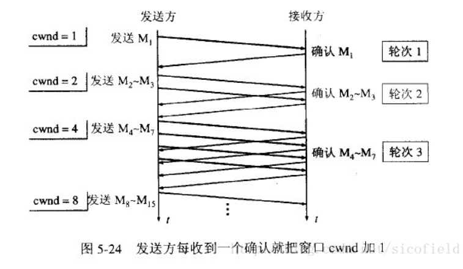

  当然收到单个确认但此确认多个数据报的时候就加相应的数值。所以一次传输轮次之后拥塞窗口就加倍。这就是乘法增长，和后面的拥塞避免算法的加法增长比较。

      为了防止cwnd增长过大引起网络拥塞，还需设置一个慢开始门限ssthresh状态变量。ssthresh的用法如下：

当cwnd<ssthresh时，使用慢开始算法。

当cwnd>ssthresh时，改用拥塞避免算法。

当cwnd=ssthresh时，慢开始与拥塞避免算法任意。
  拥塞避免算法让拥塞窗口缓慢增长，即每经过一个往返时间RTT就把发送方的拥塞窗口cwnd加1，而不是加倍。这样拥塞窗口按线性规律缓慢增长。

 无论是在慢开始阶段还是在拥塞避免阶段，只要发送方判断网络出现拥塞（其根据就是没有收到确认，虽然没有收到确认可能是其他原因的分组丢失，但是因为无法判定，所以都当做拥塞来处理），就把慢开始门限设置为出现拥塞时的发送窗口大小的一半。然后把拥塞窗口设置为1，执行慢开始算法。如下图：

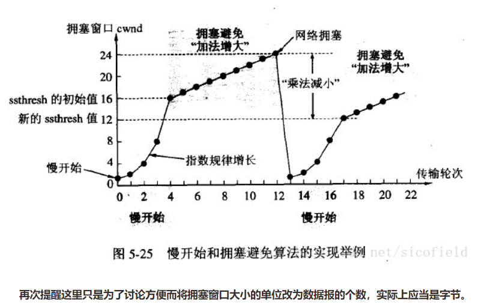
## 10.2. 快重传和快恢复
  快重传要求接收方在收到一个失序的报文段后就立即发出重复确认（为的是使发送方及早知道有报文段没有到达对方）而不要等到自己发送数据时捎带确认。快重传算法规定，发送方只要一连收到三个重复确认就应当立即重传对方尚未收到的报文段，而不必继续等待设置的重传计时器时间到期。如下图：
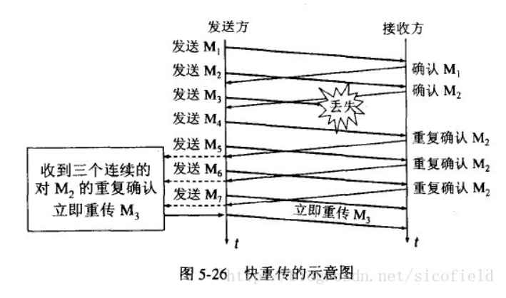

快重传配合使用的还有快恢复算法，有以下两个要点:

①当发送方连续收到三个重复确认时，就执行“乘法减小”算法，把ssthresh门限减半。但是接下去并不执行慢开始算法。

②考虑到如果网络出现拥塞的话就不会收到好几个重复的确认，所以发送方现在认为网络可能没有出现拥塞。所以此时不执行慢开始算法，而是将cwnd设置为ssthresh的大小，然后执行拥塞避免算法。如下图：
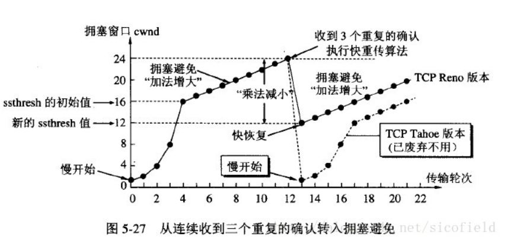

补充：发送窗口应该等于接受窗口与拥塞窗口中最小的一个。