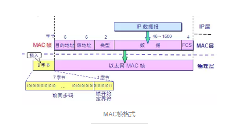
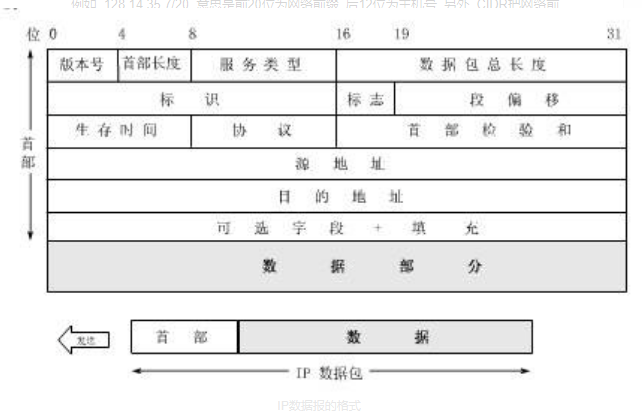

# 1. 网络模型： 
①、OSI/RM（Open System Interconnection Reference Model开放式系统互连基本参考模型），是由ISO（International Standards Organization国际标准化组织）提出的网络参考模型。

②、TCP/IP（Transmission Control Protocol/Internet Protocol 传输控制协议/因特网互联协议）

③、两种网络模型的主要区别： 
OSI/RM：7层模型。从低到高分别是：物理层、数据链路层、网络层、传输层、会话层、表示层、应用层 
OSI/RM模型的网络层同时支持面向连接和无连接的通信，但是传输层只支持面向连接的通信。 
TCP/IP：4层模型。从低到高分别是：网络接口层、网络层、传输层、应用层 
TCP/IP模型的网络层只提供无连接的服务，但是传输层上同时提供两种通信模式。

# 2. OSI的7层模型　
## 2.1. 物理层（Physical Layer）
　　计算机的世界里只有0和1, 正如你现在所看这篇文章的文字, 存储在计算机中也是一大串0和1的组合. 但是这些数字不能在真实的物理介质中传输的, 而需要把它转换为光信号或者电信号, 所以这一层负责将这些比特流(0101)与光电信号进行转换.
如果没有物理层, 那么也就不存在互联网, 不存在数据的共享, 因为数据无法在网络中流动.

　　物理层规定了激活、维持、关闭通信端点之间的机械特性、电气特性、功能特性以及过程特性。该层为上层协议提供了一个传输数据的物理媒体。
　　
　　在这一层，数据的单位称为比特（bit）。
　　
　　属于物理层定义的典型规范代表包括：EIA/TIA RS-232、EIA/TIA RS-449、V.35、RJ-45等。
　　
## 2.2. 数据链路层（Data Link Layer）
　　数据在这一层不再是以比特流的形式传输, 而是分割成一个一个的帧再进行传输.

　　数据链路层在不可靠的物理介质上提供可靠的传输。该层的作用包括：物理地址寻址、数据的成帧、流量控制、数据的检错、重发等。
　　
　　在这一层，数据的单位称为帧（frame）。
　　
　　数据链路层协议的代表包括：SDLC、HDLC、PPP、STP、帧中继等。

- MAC地址
又称计算机的硬件地址, 被固化在适配器(网卡)ROM上的占48位的地址. MAC地址可以用来唯一区别一台计算机, 因为它在全球是独一无二的
ps : 当一台计算机不止有一个网卡时, MAC地址就不能唯一对应一台计算机了. 例如, 一台计算机装了2个网卡, 一个是用于该计算机与外界通信, 而第二个网卡则用来公司内部局域网通信. 这时候虽然有两个MAC地址, 但是其实是同一台计算机.

- 网桥
网桥工作在数据链路层, 根据MAC帧的目的地址对收到的帧进行转发和过滤.

- 以太网交换机
实际上就是一个多接口的网桥, 以太网交换机的每个接口都直接与一个单个主机或另一个集线器相连, 可以很容易实现VLAN(虚拟局域网)

- 以太网的mac帧

MAC帧格式
目的地址 : 接收方48位的MAC地址
源地址 : 发送方48位的MAC地址
类型字段 : 标志上一层使用的是什么协议, 0x0800为IP数据报


## 2.3. 网络层（Network Layer）
　　如果只有数据链路层没有网络层, 数据就只能在同一条链路上传输, 不能跨链路传输. 有了网络层, 数据便能跨域不同的数据链路传输.

　　网络层负责对子网间的数据包进行路由选择。此外，网络层还可以实现拥塞控制、网际互连等功能。
　　
　　在这一层，数据的单位称为数据包（packet）。
　　
　　网络层协议的代表包括：IP、IPX、RIP、OSPF等。

-  IP地址和MAC地址
网络层以上使用IP地址, 数据链路层以下使用MAC地址
IP地址是逻辑地址, MAC地址是物理地址
IP分组中首部的源地址和目的地址在传输中不会改变, MAC帧中首部的源地址和目的地址每到一个路由器会改变一次

- IP的数据报
 
　　
　　解释：

```
　　首部前20字节为固定长度, 是所有IP数据报必备的. 后4字节是可选字段, 其长度可变.
IP数据报首部固定的字段分析 :

版本号 : IP协议的版本, IPv4或IPv6
首部长度 : 记录了首部的长度, 最大为1111, 即15个32位字长, 即60字节. 当首部长度不是4字节的整数倍时, 需要使用最后的填充字段加以填充.
服务类型 : 一般无用
总长度 : 指首部和数据之和的长度. 最大为216-1 = 65535字节. 但是由于数据链路层规定每一帧的数据长度都有最大长度MTU, 以太网规定MTU为1500字节, 所以超出范围的数据报就必须进行分片处理
标识 : 每产生一个IP数据报, 计数器就+1, 并将此值赋值给标识字段. 再以后需要分片的数据报中, 标识相同说明是同一个数据报
标志 : 占3位, 最低位记为MF(More Fragment). MF = 1说明还有分片; MF = 0说明这已经是最后一个分片. 中间一位记为DF(Don't Fragment), 意思是不能分片. 只有当DF = 0时才允许分片.
段位移 : 又称片位移, 相对于用户数据字段的起点, 该片从何处开始. 片位移以8个字节为偏移单位. 所以, 每个分片的长度一定是8字节的整数倍.
生存时间 : TTL(Time To Live). 数据报能在因特网中经过路由器的最大次数为255次, 每经过一个路由器则TTL - 1, 为0时丢弃该报文.
协议 : 记录该报文所携带的数据是使用何种协议.
首部检验和 : 只检验数据报的首部, 不检验数据部分. 不为0则丢弃报文.
源地址和目的地址 : 不解释
```

　
　　
## 2.4. 传输层（Transport Layer）
　　
　　传输层是第一个端到端，即主机到主机的层次。传输层负责将上层数据分段并提供端到端的、可靠的或不可靠的传输。此外，传输层还要处理端到端的差错控制和流量控制问题。
　　
　　在这一层，数据的单位称为数据段（segment）。
　　
　　传输层协议的代表包括：TCP、UDP、SPX等。
　　
## 2.5. 会话层（Session Layer）
　　
　　会话层管理主机之间的会话进程，即负责建立、管理、终止进程之间的会话。会话层还利用在数据中插入校验点来实现数据的同步。
　　
　　会话层协议的代表包括：NetBIOS、ZIP（AppleTalk区域信息协议）等。
　　
## 2.6. 表示层（Presentation Layer）
　　
　　表示层对上层数据或信息进行变换以保证一个主机应用层信息可以被另一个主机的应用程序理解。表示层的数据转换包括数据的加密、压缩、格式转换等。
　　
　　表示层协议的代表包括：ASCII、ASN.1、JPEG、MPEG等。
　　
## 2.7. 应用层（Application Layer）
　　
　　应用层为操作系统或网络应用程序提供访问网络服务的接口。
　　
　　应用层协议的代表包括：Telnet、FTP、HTTP、SNMP等。

# 3. TCP/IP的四层
## 3.1. 主机到网络层
　　
　　实际上TCP/IP参考模型没有真正描述这一层的实现，只是要求能够提供给其上层-网络互连层一个访问接口，以便在其上传递IP分组。由于这一层次未被定义，所以其具体的实现方法将随着网络类型的不同而不同。
　　
## 3.2. 网络互连层
　　
　　网络互连层是整个TCP/IP协议栈的核心。它的功能是把分组发往目标网络或主机。同时，为了尽快地发送分组，可能需要沿不同的路径同时进行分组传递。因此，分组到达的顺序和发送的顺序可能不同，这就需要上层必须对分组进行排序。
　　
　　网络互连层定义了分组格式和协议，即IP协议（Internet Protocol）。
　　
　　网络互连层除了需要完成路由的功能外，也可以完成将不同类型的网络（异构网）互连的任务。除此之外，网络互连层还需要完成拥塞控制的功能。
　　
## 3.3. 传输层

## 3.4. 应用层
　　
　　TCP/IP模型将OSI参考模型中的会话层和表示层的功能合并到应用层实现。
　　
　　应用层面向不同的网络应用引入了不同的应用层协议。其中，有基于TCP协议的，如 文件传输协议（File Transfer Protocol，FTP）、虚拟终端协议（TELNET）、超文本链接协议（Hyper Text Transfer Protocol，HTTP），也有基于UDP协议的，如 简易邮件传输通讯协议(Simple Mail Transfer Protocol)、TELNET及USERNET命令等等。

 传输协议TCP和UDP 
