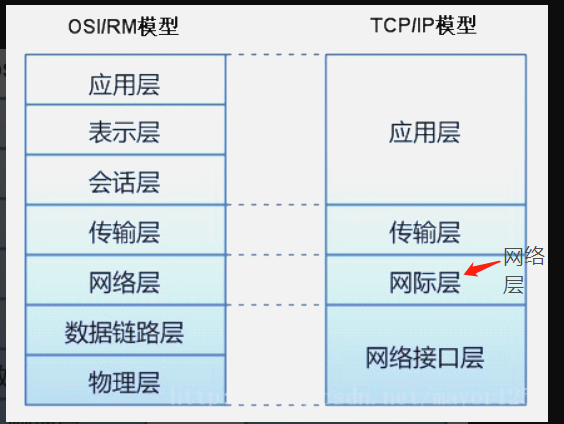

# 1. 网络模型： 
①、OSI/RM（Open System Interconnection Reference Model开放式系统互连基本参考模型），是由ISO（International Standards Organization国际标准化组织）提出的网络参考模型。

②、TCP/IP（Transmission Control Protocol/Internet Protocol 传输控制协议/因特网互联协议）

③、两种网络模型的主要区别： 
OSI/RM：7层模型。从低到高分别是：物理层、数据链路层、网络层、传输层、会话层、表示层、应用层 
OSI/RM模型的网络层同时支持面向连接和无连接的通信，但是传输层只支持面向连接的通信。 
TCP/IP：4层模型。从低到高分别是：网络接口层、网络层、传输层、应用层 
TCP/IP模型的网络层只提供无连接的服务，但是传输层上同时提供两种通信模式。

# 2. OSI的7层模型　
## 2.1. 物理层（Physical Layer）
　　
　　物理层规定了激活、维持、关闭通信端点之间的机械特性、电气特性、功能特性以及过程特性。该层为上层协议提供了一个传输数据的物理媒体。
　　
　　在这一层，数据的单位称为比特（bit）。
　　
　　属于物理层定义的典型规范代表包括：EIA/TIA RS-232、EIA/TIA RS-449、V.35、RJ-45等。
　　
## 2.2. 数据链路层（Data Link Layer）
　　
　　数据链路层在不可靠的物理介质上提供可靠的传输。该层的作用包括：物理地址寻址、数据的成帧、流量控制、数据的检错、重发等。
　　
　　在这一层，数据的单位称为帧（frame）。
　　
　　数据链路层协议的代表包括：SDLC、HDLC、PPP、STP、帧中继等。
　　
## 2.3. 网络层（Network Layer）
　　
　　网络层负责对子网间的数据包进行路由选择。此外，网络层还可以实现拥塞控制、网际互连等功能。
　　
　　在这一层，数据的单位称为数据包（packet）。
　　
　　网络层协议的代表包括：IP、IPX、RIP、OSPF等。
　　
## 2.4. 传输层（Transport Layer）
　　
　　传输层是第一个端到端，即主机到主机的层次。传输层负责将上层数据分段并提供端到端的、可靠的或不可靠的传输。此外，传输层还要处理端到端的差错控制和流量控制问题。
　　
　　在这一层，数据的单位称为数据段（segment）。
　　
　　传输层协议的代表包括：TCP、UDP、SPX等。
　　
## 2.5. 会话层（Session Layer）
　　
　　会话层管理主机之间的会话进程，即负责建立、管理、终止进程之间的会话。会话层还利用在数据中插入校验点来实现数据的同步。
　　
　　会话层协议的代表包括：NetBIOS、ZIP（AppleTalk区域信息协议）等。
　　
## 2.6. 表示层（Presentation Layer）
　　
　　表示层对上层数据或信息进行变换以保证一个主机应用层信息可以被另一个主机的应用程序理解。表示层的数据转换包括数据的加密、压缩、格式转换等。
　　
　　表示层协议的代表包括：ASCII、ASN.1、JPEG、MPEG等。
　　
## 2.7. 应用层（Application Layer）
　　
　　应用层为操作系统或网络应用程序提供访问网络服务的接口。
　　
　　应用层协议的代表包括：Telnet、FTP、HTTP、SNMP等。

# 3. TCP/IP的四层
## 3.1. 主机到网络层
　　
　　实际上TCP/IP参考模型没有真正描述这一层的实现，只是要求能够提供给其上层-网络互连层一个访问接口，以便在其上传递IP分组。由于这一层次未被定义，所以其具体的实现方法将随着网络类型的不同而不同。
　　
## 3.2. 网络互连层
　　
　　网络互连层是整个TCP/IP协议栈的核心。它的功能是把分组发往目标网络或主机。同时，为了尽快地发送分组，可能需要沿不同的路径同时进行分组传递。因此，分组到达的顺序和发送的顺序可能不同，这就需要上层必须对分组进行排序。
　　
　　网络互连层定义了分组格式和协议，即IP协议（Internet Protocol）。
　　
　　网络互连层除了需要完成路由的功能外，也可以完成将不同类型的网络（异构网）互连的任务。除此之外，网络互连层还需要完成拥塞控制的功能。
　　
## 3.3. 传输层

## 3.4. 应用层
　　
　　TCP/IP模型将OSI参考模型中的会话层和表示层的功能合并到应用层实现。
　　
　　应用层面向不同的网络应用引入了不同的应用层协议。其中，有基于TCP协议的，如 文件传输协议（File Transfer Protocol，FTP）、虚拟终端协议（TELNET）、超文本链接协议（Hyper Text Transfer Protocol，HTTP），也有基于UDP协议的，如 简易邮件传输通讯协议(Simple Mail Transfer Protocol)、TELNET及USERNET命令等等。

 传输协议TCP和UDP 
