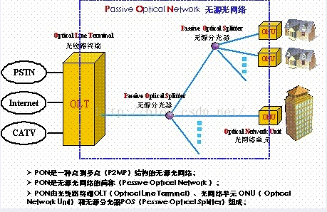
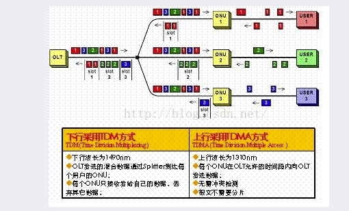
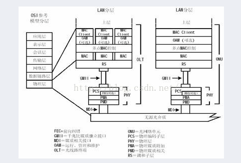
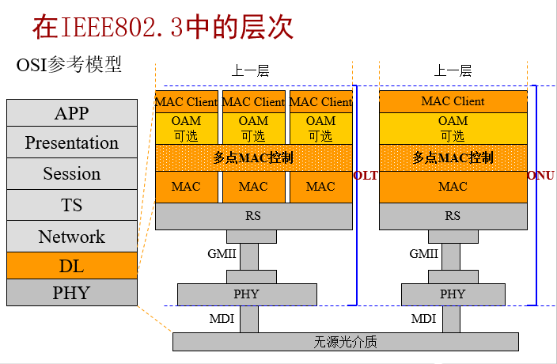
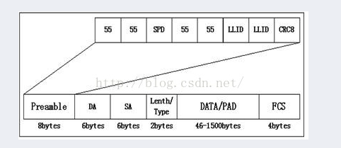
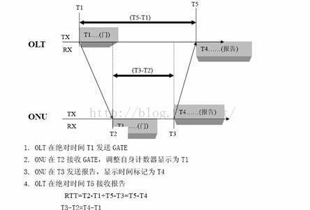

# 1. EPON
EPON是一种实现光纤到户的重要技术。
EPON（Ethernet Passive Optical Network，以太网无源光网络），顾名思义，是基于以太网的PON技术。 它采用点到多点结构、无源光纤传输，在以太网之上提供多种业务

# 2. EPON的基本特征
- 单纤双向，上行1310nm，下行1490nm

- 下行广播发送，选择接收

- 上行TDM方式发送，分享带宽

- 直接基于以太网包传输，数据业务不需映射或处理，与IP网络紧密结合

- TDM等异质协议数据包需要映射，关键特性能够保证

- 传输距离≤20 Km，分支比1:32

- IEEE 802.3ah,2004年7月定稿

# 3. EPON的基本原理    
EPON采用点到多点结构，无源光纤传输方式，在以太网上提供多种业务。EPON在物理层使用100BASE的以太PHY，同时在PON的传输机制上，通过新增加的MAC控制命令来控制和优化各光网络单元(ONU)与光线路终端(OLT)之间突发数据通信和实时的TDM通信，在协议的第二层，EPON采用成熟的全双工以太技术，使用TDM，由于ONU在自己的时隙内发送数据报，因此没有碰撞，不需CDMA/CD，从而充分利用宽带。

EPON系统由
**OLT**
**POS**
**ONU**构成。

OLT放在中心机房，ONU放在用户设备端附近或与其合成一体。POS是无源光纤分支器，是连接OLT和ONU的无源设备，它的功能是分发下行数据，并集中上行数据。（注：POS相当于PON技术中的ONT设备）

EPON利用单芯光纤，在一根芯上转送上下行两个波（上行波长：1310nm，下行波长：1490nm，另外还可以在这个芯上下行叠加1550nm的波长，来传递模拟电视信号）。

OLT即是一个交换机或路由器，又是一个多业务提供平台，它提供面向无源光纤网络的光纤接口（PON接口）。OLT上将提供多个1Gbps和10Gbps的以太接口，可支持WDM（波分复用）传输。OLT根据需要可配置多块OLC（Optical line Card），OLC与多个ONU通过POS连接，POS不需要电源，可置于相对宽松的环境中，一般一个POS的分光比为8、16、32、64，并可以多级连接，一个OLT PON端口下最多可以连接的ONU数量与设备密切相关，一般是固定的。在EPON系统，OLT到ONU之间的距离最大可达20km

在下行方向，IP数据、语音、视频等多种业务位于中心局的OLT，采用广播方式，通过ODN中的1：N无源分光器分配到PON上的所有ONU单元。在上行方向，来自各个ONU的多种业务信息互不干扰地通过ODN中的1：N无源分光器耦合到同一根光纤，最终送到位于局端OLT接收端。

在下行方向，IP数据、语音、视频等多种业务位于中心局的OLT，采用广播方式，通过ODN中的1：N无源分光器分配到PON上的所有ONU单元。在上行方向，来自各个ONU的多种业务信息互不干扰地通过ODN中的1：N无源分光器耦合到同一根光纤，最终送到位于局端OLT接收端。

根据ONU的位置不同，EPON的应用模式可分为FTTC（光纤到路边）、FTTB（光纤到大楼）、FTTO（光纤到办公室）和FTTH（光纤到家）等多种类型。

在FTTC结构中，ONU放置在路边或电线杆的分线盒边，从ONU到各个用户之间采用双绞线铜缆；传送宽带图像业务，则采用同轴电缆。FTTC的主要特点之一是到用户家里面部分仍可采用现有的铜缆设施，可以推迟入户的光纤投资。从目前来看，FTTC在提供2Mbps以下窄带业务时是OAN（称光纤接入网）中最现实、最经济的方案，但如需提供窄带与宽带的综合业务,则这一结构不甚理想。

在FTTB结构中，ONU被直接放到楼内， 光纤到大楼后可以采用ADSL、Cable、LAN，即FTTB+ADSL、FTTB+Cable和FTTB+LAN等方式接入用户家中。FTTB与FTTC相比，光纤化程度进一步提高，因而更适用于高密度以及需提供窄带和宽带综合业务的用户区。            FTTO和FTTH结构均在路边设置无源分光器，并将ONU移至用户的办公室或家中，是真正全透明的光纤网络，它们不受任何传输制式、带宽、波长和传输技术的约束，是光纤接入网络发展的理想模式和长远目标

# 4. EPON的传输原理
  EPON与APON最大的区别是EPON根据IEEE802.3协议，包长可变至1518字节传送数据，而APON根据ATM协议，按照固定长度53个字节包来传送数据，其中48个字节负荷，5个字节开销。

   EPON从OLT到多个ONU下行传输数据和从多个ONU到OLT上行数据传输是不同的。

   当OLT启动后，它会周期性的在本端口上广播允许接入的时隙等信息。ONU上电后，根据OLT广播的允许接入信息，主动发起注册请求，OLT通过对ONU的认证（本过程可选），允许ONU接入，并给请求注册的ONU分配一个本OLT端口唯一的一个逻辑链路标识（LLID）

数据从OLT到多个ONU以广播式下行（时分复用技术TDM）。每一个数据帧的帧头包含前面注册时分配的、特定ONU的逻辑链路标识（LLID），该标识表明本数据帧是给ONU（ONU1、ONU2、ONU3......ONUn）中的唯一一个。另外，部分数据帧可以是给所有的ONU（广播式）或者特殊的一组ONU（组播）。当数据信号到达ONU时，ONU根据LLID，在物理层上做判断，接收给它自己的数据帧，摒弃那些给其它ONU的数据帧。

对于上行，采用时分多址接入技术（TDMA）分时隙给ONU传输上行流量。当ONU在注册时成功后，OLT会根据系统的配置，给ONU分配特定的带宽，（在采用动态带宽调整时，OLT会根据指定的带宽分配策略和各个ONU的状态报告，动态的给每一个ONU分配带宽）。

上行方向，ONU不能直接接收到其它ONU上行的信号，所以ONU之间的通信，都必须通过OLT，在OLT可以设置允许和禁止ONU之间的通信，在缺省状态下是禁止的。

# 5. EPON协议
## 5.1. EPON 的层次模型

802.3工作组定义了新的物理层。对以太网MAC层以及MAC层以上则尽量做最小的改动以支持新的应用和媒质。

EPON的层次模型如下：

## 5.2. MPCP子层

EPON建立在MPCP（Muti-Point Control Protocol多点控制协议）基础上，该协议是MAC control子层的一项功能。MPCP使用消息，状态机，定时器来控制访问P2MP（点到多点）的拓扑结构。

EPON实现了一个P2P仿真子层，该子层使得P2MP网络拓扑对于高层来说就是多个点对点链路的集合。该子层是通过在每个数据报的前面加上一个LLD（Logical Link Identification）逻辑链路标识来实现的。该LLID将替换前导码中的两个字节。PON将拓扑结构中的根结点认为是主设备，即OLT；将位于边缘部分的多个节点认为是从设备，即ONU。MPCP在点对多点的主从设备之间规定了一种控制机制以协调数据有效的发送和接收。系统运行过程中上行方向在一个时刻只允许一个ONU发送，位于OLT的高层负责处理发送的定时、不同ONU的拥塞报告、以便优化PON系统内部的带宽分配。EPON系统通过MPC PDU来实现OLT与ONU之间的带宽请求、带宽授权、测距等。

## 5.3. EPON的物理层

EPON物理层通过GMII接口与RS层相连，担负着为mac层传送可靠数据的责任。物理层的主要功能是将数据编成合适的线路码；完成数据的前向纠错；将数据通过光电、电光转换完成数据的收发。整个EPON物理层由如下几个子层构成：

物理编码子层（PCS） 前向纠错子层（FEC） 物理媒体附属子层（PMA） 物理媒体依赖子层（PMD）

同千兆以太网的物理层相比，唯一不同的是EPON的物理层多了一个前向纠错子层（FEC）。前向纠错子层完成前向纠错的功能。这个子层是一个可选的子层，它处在物理编码子层和物理媒体附属子层中间。它的存在引入使我们在选择激光器、分光器的分路比、接入网的最大传输距离时有了更大的自由。

- 物理编码子层（PCS）
   PCS子层处于物理层的最上层。PCS子层上接GMII (Gigabit Medium Independent Interface/千兆媒体独立接口)接口下接PMA子层，其实现的主要技术为8b/10b，10b/8b编码变换。CS层需要把从GMII (Gigabit Medium Independent Interface/千兆媒体独立接口)口接收到的8位并行的数据转换成10位并行的数据输出

   PCS的主要功能模块为：          

-    发送过程

从RS层通过GMII(GigabitMedium Independent Interface/千兆媒体独立接口)口发往PCS层的数据经过发送模块的处理(主要是8B/10B)：根据GMII发来的信号连续不断地产生编码后的数据流，经PMA的数据请求原语把他们立即发往PMA服务接口。输入的并行八位数据变为并行的十位数据发往PMA。

-  - 自动协商过程：设置标识通知PCS发送过程发送的是空闲码、数据、还是重新配置链路。

-  - 同步过程：PCS同步过程经PMA数据单元指示原语连续接收码流，并经同步数据单元指示原语把码流发往PCS接收过程。PCS同步过程设置同步状态标志指示是否PMA层发送来的数据是否可靠。

- 接收过程
 从PMA经过同步数据单元指示原语连续接收码流。PCS接收过程监督这些码流并且产生给GMII (Gigabit MediumIndependent Interface/千兆媒体独立接口)的数据信号，同时产生供载波监听和发送过程使用的内部标识、接收信号、监测包间空闲码。
 
 PCS子层的发送、接收过程在自动协商的指示下完成数据收发、空闲信号的收发和链路配置功能。具体数据的收发满足RD平衡规则。在链路上传输的数据除了256个数据码之外，还有12个特殊的码组作为有效的命令码组出现。

在EPON系统中，按照单纤双向全双工的方式传送数据。当OLT通过光纤向各ONU广播时，为了对各ONU区别，保证只有发送请求的ONU能收到数据包，802.3ah标准引入了LLID。这是一个两字节的字段，每个ONU由OLT分配一个网内独一无二的LLID号，这个号码决定了哪个ONU有权接收广播的数据。这个两字节的字段所处的位置见下图所示。

在各ONU向OLT突发发送数据的时候，得到授权的ONU在规定时隙里发送数据包，没有得到授权的ONU处于休息状态。这种在上行时不是连续发送数据的通信模式叫突发通信。

在OLT侧，PCS的发送和接收都处于连续的工作模式；而在ONU侧的PCS子层接收方向是连续接收OLT侧来的广播数据，而在发送方向，却是在断断续续地工作。即OUN是接收数据是广播，发送数据是断断续续。

# 6. EPON关键技术
数据链路层的关键技术主要包括：
上行信道的多址控制协议（MPCP）

ONU的即插即用问题

OLT的测距和时延补偿协议以及协议兼容性问题。

## 6.1. MPCP
由于下行信道采用广播方式，带宽分配和时延控制可以由高层协议完成，因而上行信道的MPCP便成为EPON的MAC层技术的核心。目前的802.3ah标准确定在EPON的MAC层中增加MPCP子层

MPCP子层的基石主要有3点：

- 一是上行信道采用定长时隙的TDMA方式，但时隙的分配由OLT实施；

- 二是对于ONU发出的以太网帧不作分割，而是组合，即：每个时隙可以包含若干个802．3帧，组合方式由ONU依据QoS决定；

- 三是上行信道必须有动态带宽分配（DBA）功能支持即插即用

- 服务等级协议（SLA）和QoS。

## 6.2. DBA
DBA技术是MAC层技术的关键。静态带宽由打开的窗口尺寸决定，动态带宽则根据ONU的需要，由OLT分配。
TDMA方式的最大缺点在于其带宽利用率较低，采用DBA可以提高上行带宽的利用率，在带宽相同的情况下可以承载更多的终端用户，从而降低用户成本。

## 6.3. 系统同步
EPON中的各ONU接入系统是采用时分方式，所以OLT和ONU在开始通信之前必须达到同步，才会保证信息正确传输。要使整个系统达到同步，必须有一个共同的参考时钟，在EPON中以OLT时钟为参考时钟，各个ONU时钟和OLT时钟同步。OLT周期性的广播发送同步信息给各个ONU，使其调整自己的时钟。

EPON同步的要求是在某一ONU的时刻T(ONU时钟)发送的信息比特，OLT必须在时刻T(OLT时钟)接收他。在EPON中由于各个ONU到OLT的距离不同，所以传输时延各不相同，要达到系统同步，ONU的时钟必须比OLT的时钟有一个时间提前量，这个时间提前量就是上行传输时延，也就是如果OLT在时刻0发送一个比特，ONU必须在他的时刻RTT(往返传输时延)接收。

RTT等于下行传输时延加上上行传输时延，这个RTT必须知道并传递给ONU。获得RTT的过程即为测距(ranging)。

当EPON系统达到同步时，同一OLT下面的不同ONU发送的信息才不会发生碰撞。

## 6.4. 测距和时延补偿

由于EPON的上行信道采用TDMA方式，多点接入导致各ONU的数据帧延时不同，因此必须引入测距和时延补偿技术以防止数据时域碰撞，并支持ONU的即插即用。

测距基本过程：OLT在T1时刻通过下行信道广播时隙同步信号和空闲时隙标记，已启动的ONU在T2时刻监测到一个空闲时隙标记时，将本地计时器重置为T1，然后在时刻T3回送一个包含ONU参数的（地址、服务等级等）在线响应数据帧，此时，数据帧中的本地时间戳为T4；OLT在T5时刻接收到该响应帧。通过该响应帧OLT不但能获得ONU的参数，还能计算出OLT与ONU之间的信道延时RTT＝T2－T1＋T5－T3＝T5－T4。

之后，OLT便依据DBA协议为ONU分配带宽。当ONU离线后，由于OLT长时间（如3 min）收不到ONU的时间戳标记，则判定其离线。
## 6.5. RTT补偿

在OLT侧进行延时补偿，发送给ONU的授权反映出由于RTT补偿的到达时间

