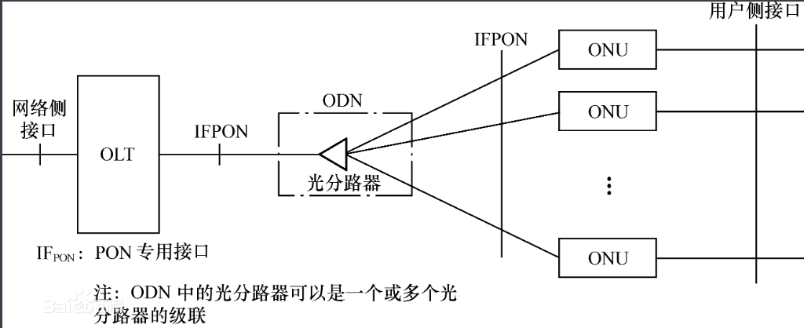

# 1. PON是什么
PON：无源光网络
         PON是一种采用点到多点（P2MP）结构的单纤双向光接入网络。PON系统由局端的光线路终端（OLT）、光分配网络（ODN）和用户侧的光网络单元（ONU）组成，为单纤双向系统。在下行方向（OLT到ONU），OLT发送的信号通过ODN到达各个ONU。在上行方向（ONU到OLT），ONU发送的信号只会到达OLT，而不会到达其他ONU。为了避免数据冲突并提高网络效率，上行方向采用TDMA多址接入方式，并对各ONU的数据发送进行管理。ODN在OLT和ONU间提供光通道。

强行解释一波：
OLT位于网络侧，放在中心局端，它可以是一个L2交换机或L3路由器，提供网络集中和接入，能完成光/电转换，带宽分配和控制各信道的连接，并有实时监控、管理及维护功能。ONU位于用户侧，实现各种电信号的处理与维护管理，提供用户侧接口。OLT与ONU之间通过无源光分路器连接，光分路器用于分发下行数据和集中上行数据。除了终端设备，PON系统中无需电器件，因此是无源的