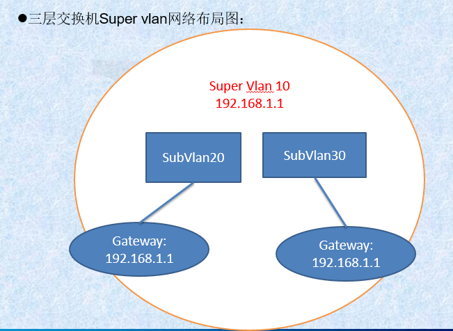
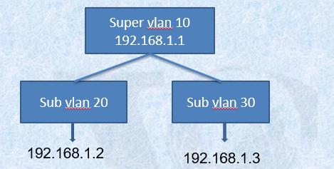

# 1. SUPER VLAN
   Super VLAN（超级VLAN）也是主要应用于服务提供商网络中，用于解决目前IPv4地址资源日趋紧张的问题。
   
   Super VLAN又称为VLAN聚合（VLAN Aggregation），其原理就是将一个Super VLAN和多个Sub VLAN（子VLAN）关联，但Super VLAN内不能加入物理端口，却可以创建对应的VLAN接口，在该VLAN接口下可以配置IP地址
   
   Sub VLAN可以加入物理端口，但不能创建对应的VLAN接口，所有Sub VLAN内的端口共用Super VLAN的VLAN接口IP地址作为默认网关，从而节省了IP地址资源；不同Sub VLAN之间仍像普通VLAN一样采用二层相互隔离。

## 1.1. Super VLAN的作用
   就是节省ip地址。使用了SuperVlan后，不需要再为每个vlan都配置路由虚接口，只要在它们SuperVlan上配置路由虚接口即可，这样也能实现vlan之间的三层互通

# 2. ARP代理
要使得sub vlan之间能实现三层互通，则必须要通过super vlan的ip进行转发。我们需要引人arp代理功能

## 2.1. ARP代理原理：
   一个物理网络的子网（subnet）中的源主机向另一个物理网络的子网中的目的主机发ARP request，和源主机直连的网关用自己接口的MAC地址代替目的主机回ARP reply，这个过程称为ARP 代理。 也称作混合ARP(ARP promiscuous)、ARP 出租(ARP hack)，或者叫(透明)子网网关((transparent) subnet ARP gateways)。

## 2.2. 过程
PROXY ARP 的基本过程如下：
        源主机向另一物理网络的子网的目的主机发ARP请求；
        
与源主机网络相连的网关已经使能ARP PROXY功能，如果存在到达目的主机的正常路由，则代替目的主机REPLY自己接口的MAC地址；

源主机向目的主机发送的IP报文都发给了路由器；

路由器对报文做正常的IP路由转发；

发往目的主机的IP报文通过网络，最终到达目的主机。

## 2.3. 举例

当192.168.1.2要发送数据报文给192.168.1.3时，首先要进行arp请求，以获得192.168.1.3的mac地址。这是当super vlan开启了arp代理后，它会以自己的mac地址代替192.168.1.3的mac地址来应答192.168.1.2的请求。

  192.168.1.2得到arp应答后所有发送到192.168.1.3的报文都转到了网关192.168.1.1上，通过192.168.1.1的转发到192.168.1.3上。从而实现sub vlan之间的互通

