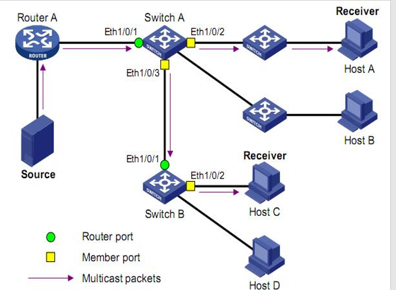
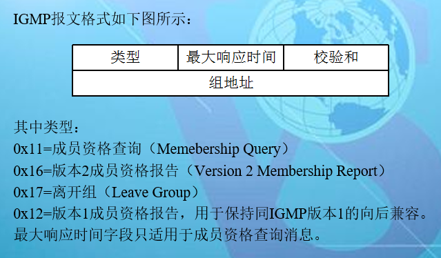
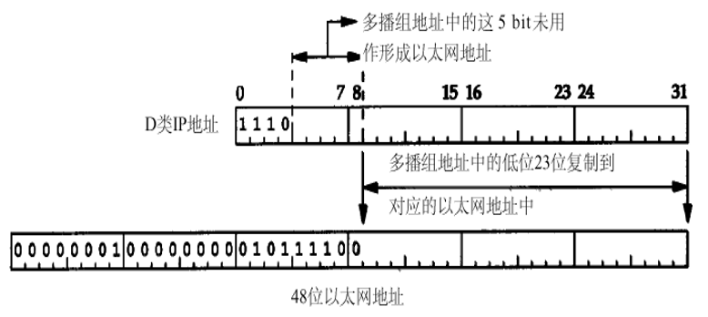

# 1. IGMP SNooping
IGMP Snooping（Internet Group Management protocol Snooping，IGMP 侦听）是运行在二层以太网交换机上的组播约束机制，用于管理和控制组播组

# 2. IGMP Snooping原理
运行IGMP Snooping 的二层设备通过对收到的IGMP报文进行分析，为端口和MAC组播地址建立起映射关系，并根据这样的映射关系转发组播数据

如下图所示，当二层设备没有运行IGMP Snooping时，组播数据在二层被广播；当二层设备运行了IGMP Snooping后，已知组播组的组播数据不会在二层被广播，而在二层被组播给指定的接收者，但是未知组播数据仍然会在二层广播

# 3. IGMP Snooping相关概念
如下图所示，Router A连接组播源，在Switch A和Switch B上分别运行IGMPsnooping，Host A和Host C为接收者主机（即组播组成员）。

结合下图，介绍一下IGMP Snooping相关的端口概念：

- 路由器端口（Router Port）
交换机上靠近三层组播设备（即DR 或IGMP 查询器）一侧的端口，如Switch A 和Switch B 各自的Ethernet1/0/1 端口。交换机将本设备上的所有路由器端口都记录在路由器端口列表中。

- 成员端口（Member Port）
表示交换机上靠近组播组成员一侧的端口，如Switch A 的Ethernet1/0/2 和Ethernet1/0/3 端口，以及Switch B 的Ethernet1/0/2 端口。交换机将本设备上的所有成员端口都记录在IGMP Snooping 转发表中。

# 4. IGMP

# 5. IGMP主要模块
## 5.1. 监听并处理来自路由器的查询报文模块
IGMP 查询器定期向本地网段内的所有主机与路由器发送IGMP 通用查询报文，以查询该网段有哪些组播组的成员。

在收到IGMP 通用查询报文时，交换机将其通过VLAN 内除接收端口以外的其它所有端口转发出去，并对该报文的接收端口做如下处理：
该端口是路由器端口列表中已有的路由器端口，则重置该路由器端口的老化定时器。
该端口不是路由器端口列表中已有的路由器端口，则将其加入路由器端口列表，并启动该路由器端口的老化定时器。

## 5.2. 监听并处理来自主机要求加入组的报文模块

以下情况，主机会向组播路由器发送IGMP 成员关系报告报文：

- 当组播组的成员主机收到IGMP查询报文后，会回复IGMP成员关系报告报文。

- 如果主机要加入某个组播组，它会主动向组播路由器发送IGMP 成员关系报告报文以声明加入该组播组。

- 在收到IGMP 成员关系报告报文时，交换机将其通过VLAN 内的所有路由器端口转发出去，从该报文中解析出主机要加入的组播组地址，并对该报文的接收端口做如下处理：
如果该端口已存在于组播组转发表中，则重置该端口的成员端口老化定时器；
如果该端口不在组播组转发表中，则在组播组转发表中为该端口增加转发表项，并启动该端口的成员端口老化定时器。

说明：
交换机不会将IGMP 成员关系报告报文通过非路由器端口转发出去，原因如下：根据IGMP 成员关系报告抑制机制，如果非路由器端口下还有该组播组的成员主机，则这些主机在收到该报告报文后便抑制了自身的报告，从而使交换机无法获知这些端口下还有该组播组的成员主机

## 5.3. 监听并处理来自主机要求离开组的报文模块

- 运行IGMPv1 的主机离开组播组时不会发送IGMP 离开组报文，因此交换机无法立即获知主机离开的信息。
但是，由于主机离开组播组后不会再发送IGMP 成员关系报告报文，因此当其对应的成员端口的老化定时器超时后，交换机就会将该端口对应的转发表项从转发表中删除。

- 运行IGMPv2 或IGMPv3 的主机离开组播组时，会通过发送IGMP 离开组报文，以通知组播路由器自己离开了某个组播组。
当从最后一个成员端口上收到IGMP 离开组报文时，交换机会将该报文通过VLAN内的所有路由器端口转发出去，同时由于并不知道该报文的接收端口下是否还有该组播组的其它成员，所以交换机不会立刻把该端口对应的转发表项从转发表中删除，而是重置该成员端口的老化定时器。

- 当IGMP 查询器收到IGMP 离开组报文后，从中解析出主机要离开的组播组的地址，并通过接收端口向该组播组发送IGMP 特定组查询报文。交换机在收到IGMP 特定组查询报文后，将其通过VLAN 内的所有路由器端口和该组播组的所有成员端口转发出去。

对于IGMP 离开组报文的接收端口，交换机在该成员端口的老化时间内：
如果从该端口收到了主机发送的响应该组播组的IGMP 成员关系报告报文，则表示该端口下还有该组播组的成员，于是重置该成员端口的老化定时器；

如果没有从该端口收到主机发送的响应该组播组的IGMP 成员关系报告报文，则表示该端口下已没有该组播组的成员，则在该成员端口老化时间超时后，将转发表中该端口对应该组播组的转发表项删除。

注意：
交换机在启动了IGMP Snooping 功能后，当收到某个组播组内的主机发出的IGMP离开报文时，会自动判断该组播组是否存在。如果该组播组不存在，则丢弃这个IGMP离开报文，不再转发。

## 5.4. 定时器超时处理模块

# 6. 组播地址结构
IP组播方式使用了数据报的目的地址来规定组播的投递。IP组播使用了D类地址。

地址的前4比特的内容是l110，指出这是一个组播地址。其余的28比特标识了特殊的组播地址。特别是，群组字段并不标出群组的来源，也不会像A，B和 C类地址那样包含一个网络地址。使用点分十进制表示法来描述组播地址的范围是：224.0.0.0  ~  239.255.255.255

# 7. IP多播地址到以太网多播地址的映射

# 8. IGMP 报文

