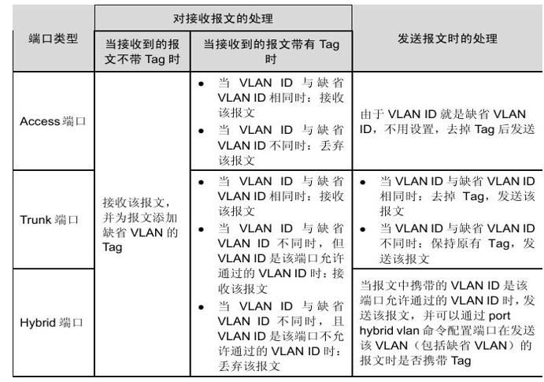

# 1. 端口的状态
全双工状态：端口可以同时发送和接受数据
半双工状态：端口只能接受或者发送数据
自动协商状态：端口接受数据是由发送端口和接受端口决定的

# 2. 以太网端口的VLAN模式
## 2.1. Access模式
端口只能属于1个vlan，一般连接计算机。配置端口为untag，pvid值为vlan值。

## 2.2. Trunk模式
端口可以属于多个 VLAN，可以接收和发送多个 VLAN 的报文，一般用于交换机之间的连接。端口为tag。

## 2.3. Hybrid模式
端口可以属于多个 VLAN，可以接收和发送多个 VLAN 的报文，可以用于交换机之间连接，也可以用于连接用户的计算机。端口可以为tag也可以为untag。目前10B的数据采用这个方式。

truck模式的区别是：hybrid允许多个vlan口发送报文时不打标签，但是truck只能在缺省的情况下才能不打标签

# 3. 交换机接口出入数据处理过程
## 3.1. 端口接收报文时的处理

Acess端口收报文:      
        收到一个报文,判断是否有VLAN信息：如果没有则打上端口的PVID，并进行交换转发,如果有则直接丢弃（缺省） 
        
   trunk端口收报文：       
        收到一个报文，判断是否有VLAN信息：如果没有则打上端口的PVID，并进行交换转发，如果有判断该trunk端口是否允许该 VLAN的数据进入：如果允许则报文携带原有VLAN标记进行转发，否则丢弃该报文。 
        
   hybrid端口收报文：       
        收到一个报文,判断是否有VLAN信息：如果没有则打上端口的PVID，并进行交换转发，如果有则判断该hybrid端口是否允许该VLAN的数据进入：如果可以则转发，否则丢弃

## 3.2. 端口发送报文时的处理

   Acess端口发报文：
        将报文的VLAN信息剥离，直接发送出去 
        
   trunk端口发报文：
        比较端口的PVID和将要发送报文的VLAN信息，如果两者相等则剥离VLAN信息，再发送，否则报文将携带原有的VLAN标记进行转发。
        
   hybrid端口发报文：
        1、判断该VLAN在本端口的属性
        2、如果是untag则剥离VLAN信息，再发送，如果是tag则比较端口的PVID和将要发送报文的VLAN信息，如果两者相等则剥离VLAN信息，再发送，否则报文将携带原有的VLAN标记进行转发

## 3.3. 总结

