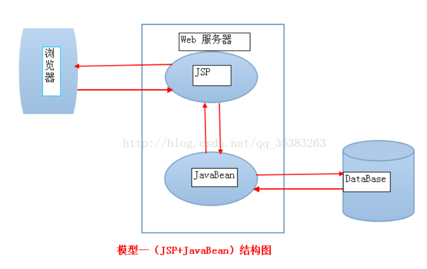
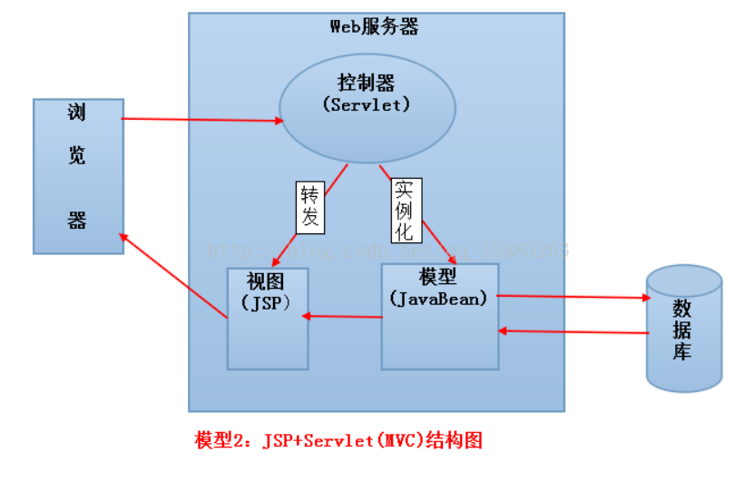
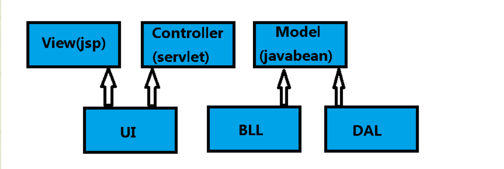

# 1. JavaWeb的开发模式
## 1.1. 模型一

## 1.2. 模型二
- 模型1使用JSP+JavaBean技术将页面显示和业务逻辑分开，由JSP实现页面显示，JavaBean对象保存数据和实现业务逻辑。

客户端（浏览器）直接向JSP发出请求，JSP做出响应，并调用JavaBean对象来处理数据，然后在返回JSP并由JSP生成最后的结果。

（其中JavaBean就是通过JDBC访问企业数据库）

- 模型2就是MVC设计思想下的架构，Servlet是控制器，JSP是视图，JavaBean是模型。

浏览器的请求都提交给Servlet，Servlet实例化JavaBean的处理请求，并根据处理结果返回不同的JSP到客户端浏览器。

（其中JavaBean使用JDBC访问企业数据库）

# 2. JavaEE三层架构
## 2.1. 三层架构
- 表现层（UI）
通俗讲就是展现给用户的界面，即用户在使用一个系统的时候他的所见所得。
即html页面等前端页面

- 业务逻辑层（BLL）
 针对具体问题的操作，也可以说是对数据层的操作，对数据业务逻辑处理
 即JavaWeb中的Service层
 
- 数据访问层（DAL）
该层所做事务直接操作数据库，针对数据的增添、删除、修改、查找等
即JavaWeb中的Dao层
## 2.2. 为什么要分成三层
　三层是为了解决整个应用程序中各个业务操作过程中不同阶段的代码封装的问题，为了使程序员更加专注的处理某阶段的**业务逻辑**,**如果需要,可以划分成更多层**
# 3. JavaEE和MVC模式的区别
## 3.1. MVC思想
- MVC是在应用程序（BS结构）的视图层划分出来的不同功能的几个模块。
- MVC主要是为了解决应用程序用户界面的样式替换问题，把**展示数据的 HTML 页面尽可能的和业务代码分离**(目的)
- MVC把纯净的界面展示逻辑（用户界面）独立到一些文件中（Views），把一些和用户交互的程序逻辑（Controller）单独放在一些文件中，在 Views 和 Controller 中传递数据使用一些专门封装数据的实体对象，这些对象，统称为Models
## 3.2. 区别
如果硬要给他们对应的话，
- 三层架构中的UI对应MVC中的view（jsp），都是用于显示以及获取界面的数据
- 三层架构中的BLL层和DAL层对应MVC中的Model（javabean）层都是用于处理上层传递来的数据以及从数据库获取的数据的
- MVC中的Controller（Servlet）最多算是三层架构中的UI的一部分，也就我们常说的是Servlet

