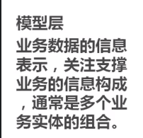
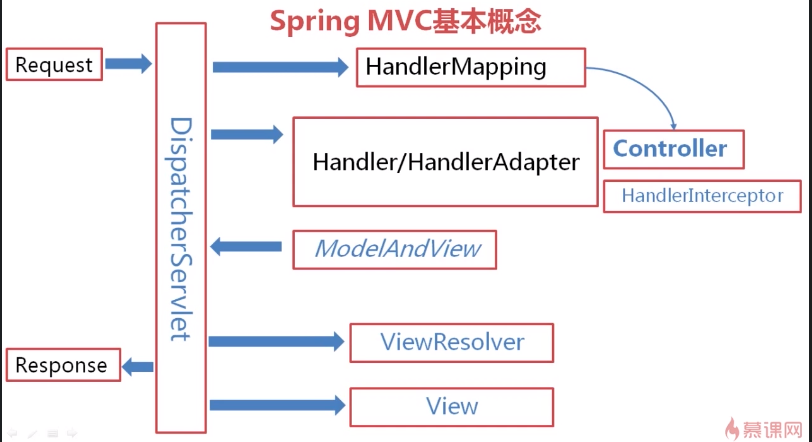

# 1. MVC的本质
MVC的核心思想就是将业务数据抽取同业务数据呈现相分离
# 2. MVC是什么
是一种软件架构的思想，将一个软件按照模型、视图、控制器进行划分。其中
模型用来封装业务逻辑
视图用来实现表示逻辑
控制器用来协调模型与视图(视图要通过控制器来调用模型，模型返回的处理结果也要先交给控制器，由控制器来选择合适的视图来显示 处理结果)
# 3. MVC的概念
- View：视图层
- Model：模型层
- Controller：控制层

# 4. Spring MVC的概念

增长记忆

JavaEE和MVC模式的区别

