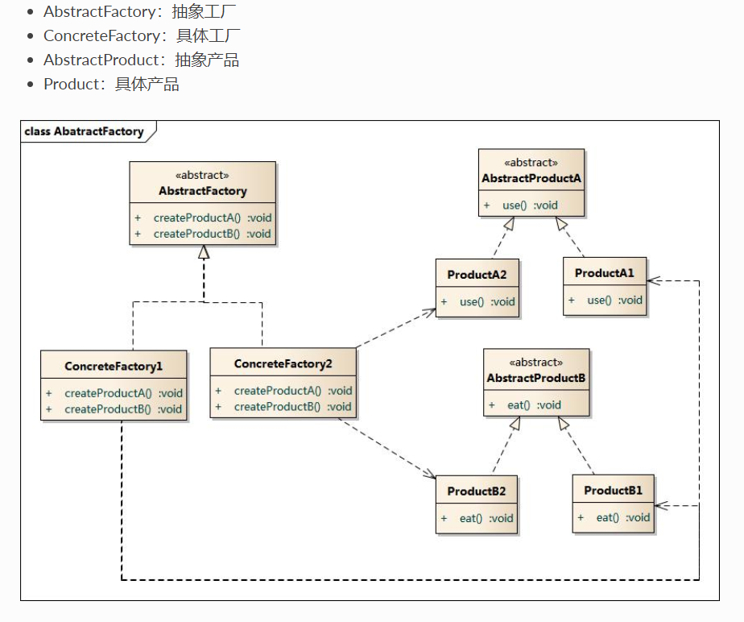

# 1. 模式动机
在工厂方法模式中具体工厂负责生产具体的产品，每一个具体工厂对应一种具体产品，工厂方法也具有唯一性，一般情况下，一个具体工厂中只有一个工厂方法或者一组重载的工厂方法。但是有时候我们需要一个工厂可以提供多个产品对象，而不是单一的产品对象。

为了更清晰地理解工厂方法模式，需要先引入两个概念：

产品等级结构 ：产品等级结构即产品的继承结构，如一个抽象类是电视机，其子类有海尔电视机、海信电视机、TCL电视机，则抽象电视机与具体品牌的电视机之间构成了一个产品等级结构，抽象电视机是父类，而具体品牌的电视机是其子类。
产品族 ：在抽象工厂模式中，产品族是指由同一个工厂生产的，位于不同产品等级结构中的一组产品，如海尔电器工厂生产的海尔电视机、海尔电冰箱，海尔电视机位于电视机产品等级结构中，海尔电冰箱位于电冰箱产品等级结构中。
当系统所提供的工厂所需生产的具体产品并不是一个简单的对象，而是多个位于不同产品等级结构中属于不同类型的具体产品时需要使用抽象工厂模式。

抽象工厂模式是所有形式的工厂模式中最为抽象和最具一般性的一种形态。

抽象工厂模式与工厂方法模式最大的区别在于，工厂方法模式针对的是一个产品等级结构，而抽象工厂模式则需要面对多个产品等级结构，一个工厂等级结构可以负责多个不同产品等级结构中的产品对象的创建 。当一个工厂等级结构可以创建出分属于不同产品等级结构的一个产品族中的所有对象时，抽象工厂模式比工厂方法模式更为简单、有效率
# 2. 模式定义
抽象工厂模式(Abstract Factory Pattern)：提供一个创建一系列相关或相互依赖对象的接口，而无须指定它们具体的类。抽象工厂模式又称为Kit模式，属于对象创建型模式。
# 3. 模式结构

# 4. 优点
抽象工厂模式隔离了具体类的生成，使得客户并不需要知道什么被创建。由于这种隔离，更换一个具体工厂就变得相对容易。所有的具体工厂都实现了抽象工厂中定义的那些公共接口，因此只需改变具体工厂的实例，就可以在某种程度上改变整个软件系统的行为。另外，应用抽象工厂模式可以实现高内聚低耦合的设计目的，因此抽象工厂模式得到了广泛的应用。
当一个产品族中的多个对象被设计成一起工作时，它能够保证客户端始终只使用同一个产品族中的对象。这对一些需要根据当前环境来决定其行为的软件系统来说，是一种非常实用的设计模式。
增加新的具体工厂和产品族很方便，无须修改已有系统，符合“开闭原则”
# 5. 缺点
在添加新的产品对象时，难以扩展抽象工厂来生产新种类的产品，这是因为在抽象工厂角色中规定了所有可能被创建的产品集合，要支持新种类的产品就意味着要对该接口进行扩展，而这将涉及到对抽象工厂角色及其所有子类的修改，显然会带来较大的不便。
开闭原则的倾斜性（增加新的工厂和产品族容易，增加新的产品等级结构麻烦）
# 6. 适用环境
在很多软件系统中需要更换界面主题，要求界面中的按钮、文本框、背景色等一起发生改变时，可以使用抽象工厂模式进行设计

# 7. 工厂模式的退化
当抽象工厂模式中每一个具体工厂类只创建一个产品对象，也就是只存在一个产品等级结构时，抽象工厂模式退化成工厂方法模式；当工厂方法模式中抽象工厂与具体工厂合并，提供一个统一的工厂来创建产品对象，并将创建对象的工厂方法设计为静态方法时，工厂方法模式退化成简单工厂模式。
# 8. 总结
抽象工厂模式提供一个创建一系列相关或相互依赖对象的接口，而无须指定它们具体的类。抽象工厂模式又称为Kit模式，属于对象创建型模式。
抽象工厂模式包含四个角色：抽象工厂用于声明生成抽象产品的方法；具体工厂实现了抽象工厂声明的生成抽象产品的方法，生成一组具体产品，这些产品构成了一个产品族，每一个产品都位于某个产品等级结构中；抽象产品为每种产品声明接口，在抽象产品中定义了产品的抽象业务方法；具体产品定义具体工厂生产的具体产品对象，实现抽象产品接口中定义的业务方法。
抽象工厂模式是所有形式的工厂模式中最为抽象和最具一般性的一种形态。抽象工厂模式与工厂方法模式最大的区别在于，工厂方法模式针对的是一个产品等级结构，而抽象工厂模式则需要面对多个产品等级结构。
抽象工厂模式的主要优点是隔离了具体类的生成，使得客户并不需要知道什么被创建，而且每次可以通过具体工厂类创建一个产品族中的多个对象，增加或者替换产品族比较方便，增加新的具体工厂和产品族很方便；主要缺点在于增加新的产品等级结构很复杂，需要修改抽象工厂和所有的具体工厂类，对“开闭原则”的支持呈现倾斜性。
抽象工厂模式适用情况包括：一个系统不应当依赖于产品类实例如何被创建、组合和表达的细节；系统中有多于一个的产品族，而每次只使用其中某一产品族；属于同一个产品族的产品将在一起使用；系统提供一个产品类的库，所有的产品以同样的接口出现，从而使客户端不依赖于具体实现。
# 9. 区别
工厂方法模式：
一个抽象产品类，可以派生出多个具体产品类。   
一个抽象工厂类，可以派生出多个具体工厂类。   
每个具体工厂类只能创建一个具体产品类的实例。

抽象工厂模式：
多个抽象产品类，每个抽象产品类可以派生出多个具体产品类。   
一个抽象工厂类，可以派生出多个具体工厂类。   
每个具体工厂类可以创建多个具体产品类的实例，也就是创建的是一个产品线下的多个产品。   
    
区别：
工厂方法模式只有一个抽象产品类，而抽象工厂模式有多个。   
工厂方法模式的具体工厂类只能创建一个具体产品类的实例，而抽象工厂模式可以创建多个。
工厂方法创建 "一种" 产品，他的着重点在于"怎么创建"，也就是说如果你开发，你的大量代码很可能围绕着这种产品的构造，初始化这些细节上面。也因为如此，类似的产品之间有很多可以复用的特征，所以会和模版方法相随。 

抽象工厂需要创建一些列产品，着重点在于"创建哪些"产品上，也就是说，如果你开发，你的主要任务是划分不同差异的产品线，并且尽量保持每条产品线接口一致，从而可以从同一个抽象工厂继承。
 

 

对于java来说，你能见到的大部分抽象工厂模式都是这样的：
---它的里面是一堆工厂方法，每个工厂方法返回某种类型的对象。

比如说工厂可以生产鼠标和键盘。那么抽象工厂的实现类（它的某个具体子类）的对象都可以生产鼠标和键盘，但可能工厂A生产的是罗技的键盘和鼠标，工厂B是微软的。

这样A和B就是工厂，对应于抽象工厂；
每个工厂生产的鼠标和键盘就是产品，对应于工厂方法；

用了工厂方法模式，你替换生成键盘的工厂方法，就可以把键盘从罗技换到微软。但是用了抽象工厂模式，你只要换家工厂，就可以同时替换鼠标和键盘一套。如果你要的产品有几十个，当然用抽象工厂模式一次替换全部最方便（这个工厂会替你用相应的工厂方法）

所以说抽象工厂就像工厂，而工厂方法则像是工厂的一种产品生产线